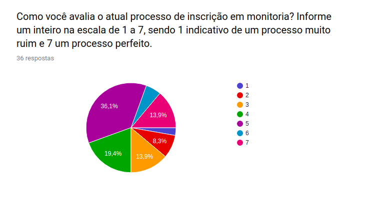
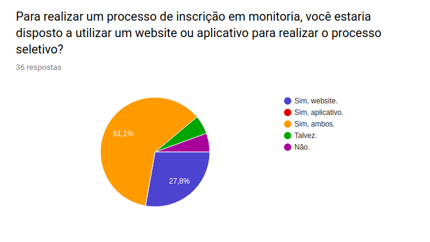
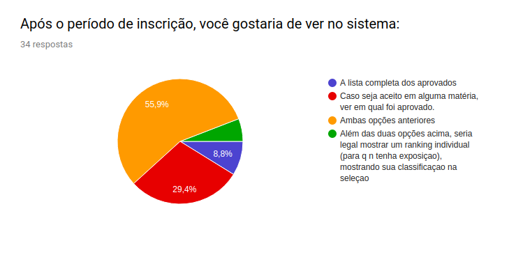

# Análise Questionário

| Data | Versão | Descrição | Autor(es)|
|:----:|:------:|:---------:|:--------:|
| 28/08/19 | 0.1 | Criação da análise do questionário| [Ivan Dobbin](https://github.com/darmsDD) |
| 28/08/19 | 0.2 | Adição dos gráficos para a análise do questionário| [Ivan Dobbin](https://github.com/darmsDD) |

## Introdução
Esta análise foi feita com o intuito de entender quais foram as opniões de nosso público alvo e assim poder se necessário realizar mudanças na ideia do projeto.

## Análise

### Tronco comum

### Ramificação Usuário que não deseja utilizar aplicativo nem website

### Ramificação Usuário que deseja utilizar um aplicativo ou website

### SubRamificação Aluno

### SubRamificação Professor
Não foi possível fazer análise dessa subramificação pois não houve amostra deste tipo de público para a pesquisa.

### Questao final comum a todos

Agora, escreva um pequeno texto sobre os piores aspectos do processo de inscrição em monitoria. Você possui alguma sugestão?

13 respostas

| Respostas|
|:-----------:|
|melhorar a divulgaçao de inicio da seleçao, menos exposiçao do aluno, informar apenas o nome dos monitores para o professor, acho q só|
|Não demorar para sair o resultado|
|Não|
|Processo demorado demais|
|Demora de lançar as inscrições e resultados|
|Alguns monitores não aparecem para dar apoio, outros nem mesmo sabem a matéria direito.|
|Atualmente melhorou bastante em relação a antes.|
|Todo semestre é um link diferente. Eu não tenho ideia se eu estou próximo ou distante de conseguir a vaga.|
|O fato de mostrar a pontuação de todos os aprovados é muito ruim.|
|O processo quase não lida com o professor, sendo que diversas vezes o professor sabe que o aluno esta preparado mas tem que passar por toda uma burocracia desnecessária pra conseguir a vaga|
|Deve averiguar se o monitor entende minimamente conceitos críticos das matérias. Além de ser capaz de transmitir seus conhecimentos, e se tem algum nível de organização para poder responder e marcar monitorias.|
|O pior problema em minha opinião é a falta de esclarecimento acerca de quantas vagas existem pra monitorar uma dada disciplina, bem como a falta da possibilidade de visualizar a atual fila de inscritos para monitorar essa disciplina, ordenada por quem tem mais chances de conseguir a vaga.|

