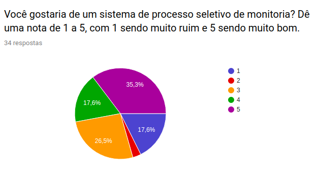

# Análise Questionário

| Data | Versão | Descrição | Autor(es)|
|:----:|:------:|:---------:|:--------:|
| 28/08/19 | 0.1 | Criação da análise do questionário| [Ivan Dobbin](https://github.com/darmsDD) |
| 28/08/19 | 0.2 | Adição dos gráficos para a análise do questionário| [Ivan Dobbin](https://github.com/darmsDD) |
| 28/08/19 | 0.3 | Adição da análise do tronco comum do questionário | [Welison Regis](https://github.com/WelisonR) |
| 28/08/19 | 0.4 | Adição da introdução | [Welison Regis](https://github.com/WelisonR) |

## Introdução
Esta análise foi feita com o intuito de entender quais foram as opiniões de nosso público-alvo de forma a melhor compreender o atual nível de satisfação com o processo seletivo de monitores realizado na Faculdade do Gama (UnB-FGa). A atual análise servirá de respaldo também para visualizar as necessidades, preferências e reclamações daqueles envolvidos no atual processo seletivo para assim ser possível adaptar e melhorar tais aspectos na aplicação a ser desenvolvida pelo grupo.

!!! info "Questionário original"
    As perguntas do questionário podem ser visualizadas [aqui](questionario.md).

## Análise

### Tronco comum

#### Questão 01 - Pergunta

#### Questão 01 - Análise

Conforme pode-se notar, a questão obteve **36 respostas**. Observa-se que o público-alvo entende que o **processo seletivo atual de monitoria é razoável**, pois aproximadamente **70% das notas concentram-se no intervalo de [3, 5]**. Além disso, apenas 13,9% dos entrevistados consideram que o processo seletivo de monitores é perfeito, o que evidencia que há muito a melhorar em muitos aspectos do processo.

#### Questão 02 - Pergunta

#### Questão 02 - Análise

Sobre os aspectos negativos sobre o atual processo seletivo de monitores, pode-se notar razões comuns entre os entrevistados. Pela análise do gráfico, entende-se que o **"processo é lento, devagar. Monitores só são disponibilizados depois de 2 semanas"**. Além disso, elenca-se como outro fator negativo o fato da **"necessidade de preenchimento de informações repetidas vezes, todos os semestres"**.

#### Questão 03 - Pergunta

#### Questão 03 - Análise

De acordo com o gráfico, há uma preferência maior pela disponibilidade da aplicação de processo seletivo em monitoria em ambas as plataformas, isto é, **mobile e desktop**. Porém, é possível notar também que, ao confrontar a preferência entre as plataformas, a **aplicação desenvolvida em ambiente web possui maior preferência**.

### Ramificação Usuário que não deseja utilizar aplicativo nem website

### Ramificação Usuário que deseja utilizar um aplicativo ou website

### SubRamificação Aluno

### SubRamificação Professor
Não foi possível fazer análise dessa subramificação pois não houve amostra deste tipo de público para a pesquisa.

### Questao final comum a todos

Agora, escreva um pequeno texto sobre os piores aspectos do processo de inscrição em monitoria. Você possui alguma sugestão?

13 respostas

| Respostas|
|:-----------:|
|melhorar a divulgaçao de inicio da seleçao, menos exposiçao do aluno, informar apenas o nome dos monitores para o professor, acho q só|
|Não demorar para sair o resultado|
|Não|
|Processo demorado demais|
|Demora de lançar as inscrições e resultados|
|Alguns monitores não aparecem para dar apoio, outros nem mesmo sabem a matéria direito.|
|Atualmente melhorou bastante em relação a antes.|
|Todo semestre é um link diferente. Eu não tenho ideia se eu estou próximo ou distante de conseguir a vaga.|
|O fato de mostrar a pontuação de todos os aprovados é muito ruim.|
|O processo quase não lida com o professor, sendo que diversas vezes o professor sabe que o aluno esta preparado mas tem que passar por toda uma burocracia desnecessária pra conseguir a vaga|
|Deve averiguar se o monitor entende minimamente conceitos críticos das matérias. Além de ser capaz de transmitir seus conhecimentos, e se tem algum nível de organização para poder responder e marcar monitorias.|
|O pior problema em minha opinião é a falta de esclarecimento acerca de quantas vagas existem pra monitorar uma dada disciplina, bem como a falta da possibilidade de visualizar a atual fila de inscritos para monitorar essa disciplina, ordenada por quem tem mais chances de conseguir a vaga.|

