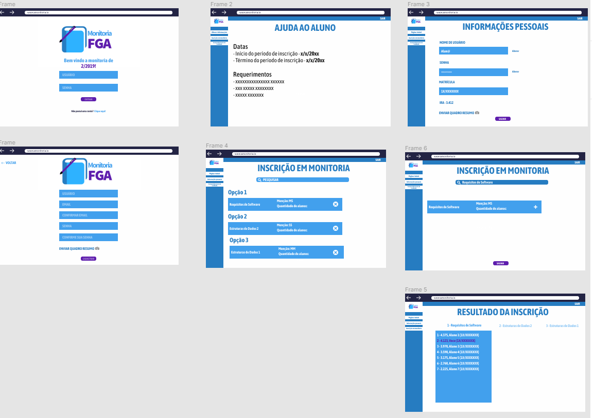
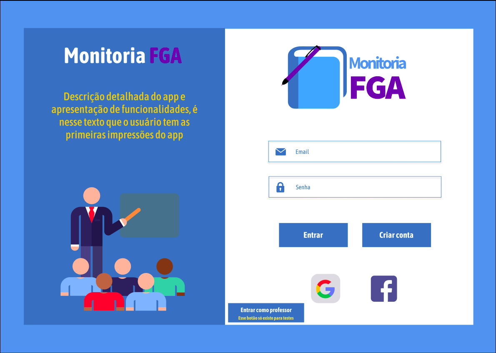
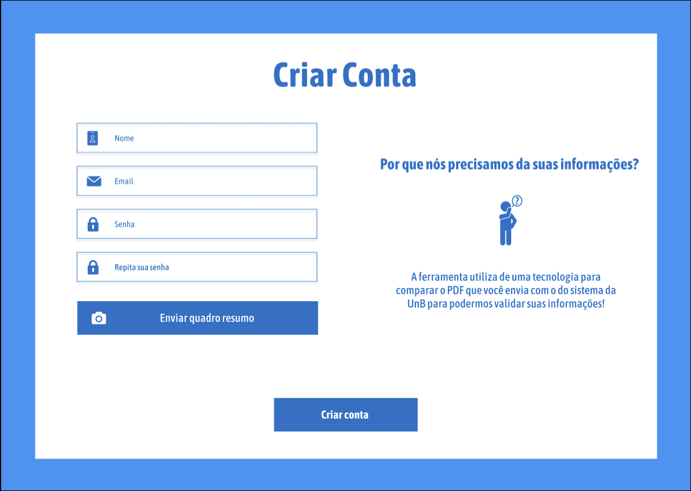
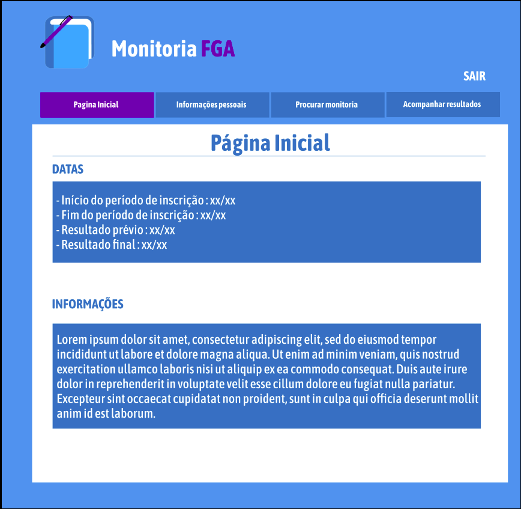
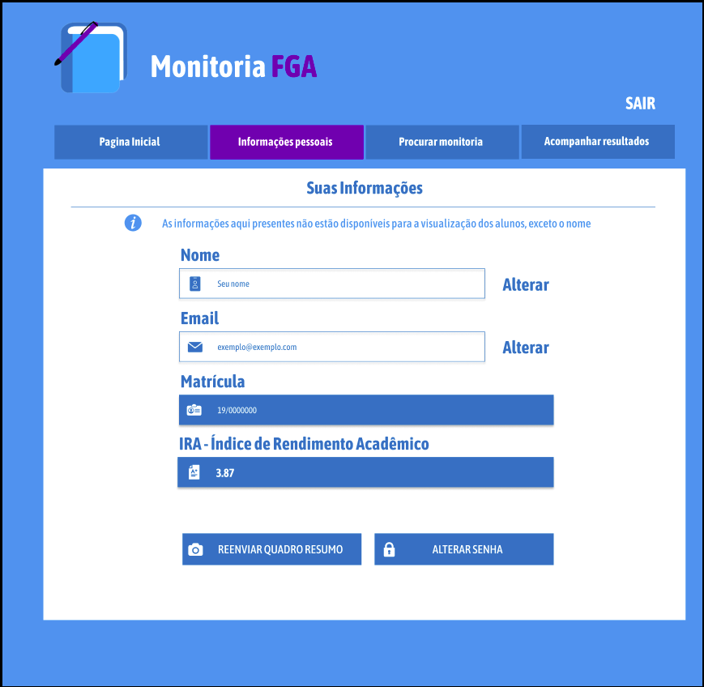
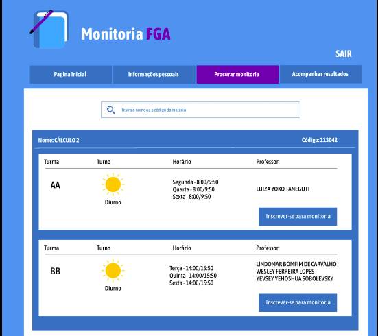
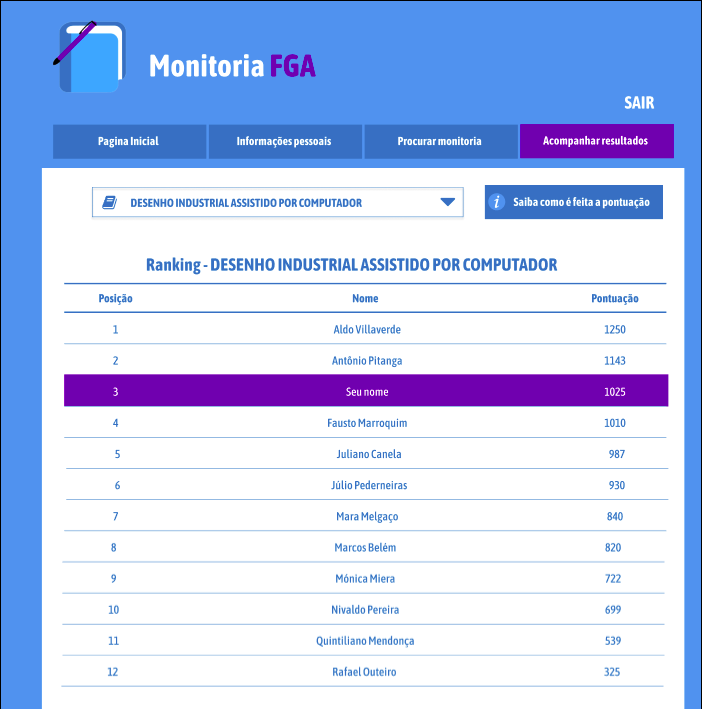

# PROTÓTIPO DO TEMA DEFINIDO

## Histórico de revisão

| Data | Versão | Descrição | Autor(es)|
|:----:|:------:|:---------:|:--------:|
| 22/08/19 | 0.1 | Adição do Protótipo | [João Gabriel](https://github.com/bielrossi15) e [Paulo Vitor Rocha](https://github.com/PauloVitorRocha) |
| 17/11/19 | 1.0 | Adição da segunda versão do protótipo | [João Rodrigues](https://github.com/rjoao) |

## Introdução
O objetivo da criação de um protótipo navegável é ter uma visão um pouco mais funcional do projeto, para entender como certas coisas e ideias se encaixariam como um todo, facilitando a compreensão tanto do time de desenvolvedores, como do próprio cliente.

## Protótipo
[Link para o protótipo](https://www.figma.com/proto/tN6ggOP6Tnvm2iMgVPt2R1/Untitled?node-id=6%3A114&scaling=contain)

### Versão 1.0

### Versão 2.0

#### Página de Login

#### Página de Cadastro

#### Página Inicial

#### Página de Informações Pessoais

#### Página de Cadastro em Monitoria

#### Página de Resultados 

