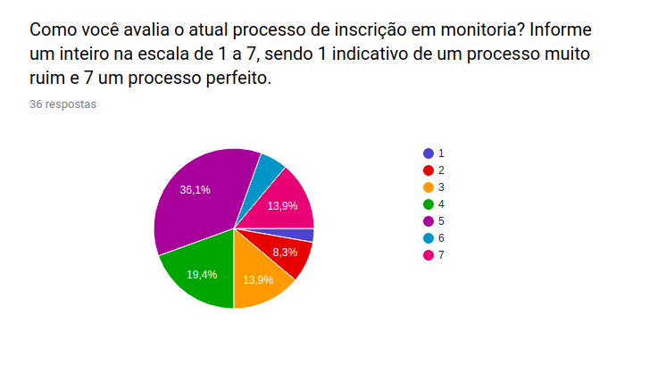
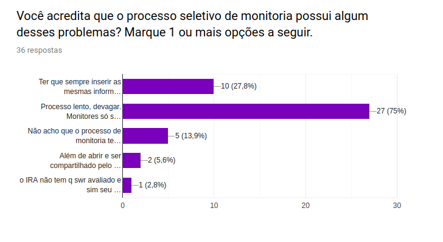
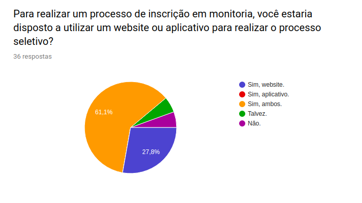
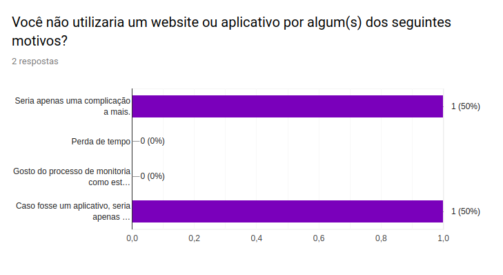
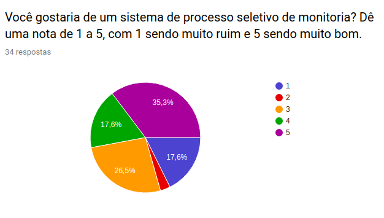
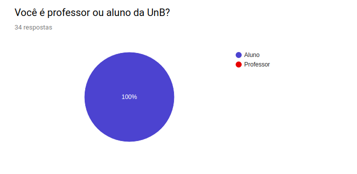
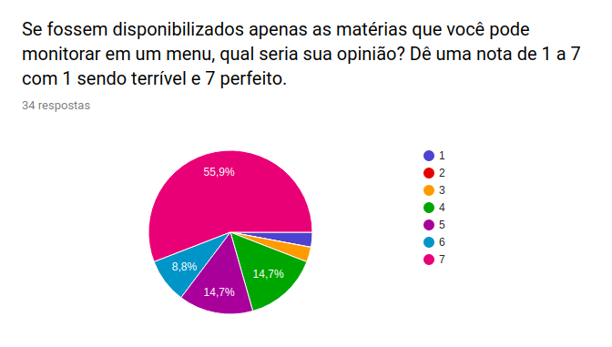
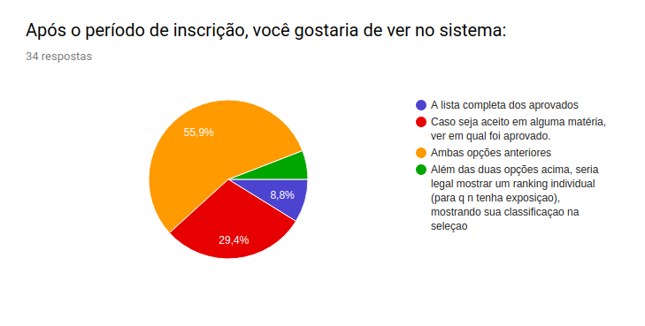

# Questionário

## Histórico de revisão

| Data | Versão | Descrição | Autor(es)|
|:----:|:------:|:---------:|:--------:|
| 20/08/19 | 0.1 | Criação do Questionário| [Welison Regis](https://github.com/WelisonR) e [Ivan Dobbin](https://github.com/darmsDD) |
| 20/08/19 | 0.2 | Perguntas do tronco base foram adicionadas| [Ivan Dobbin](https://github.com/darmsDD) e [Welison Regis](https://github.com/WelisonR)  |
| 20/08/19 | 0.3 | Adição das Ramificações e SubRamificações||
| 20/08/19 | 0.4 | Adição da Introdução |[Ivan Dobbin](https://github.com/darmsDD)|
| 23/08/19 | 0.5 | Correção estética nos questionários |[Gustavo Lima](https://github.com/gustavolima00)|
| 28/08/19 | 0.6 |Adição da análise do tronco comum do questionário | [Welison Regis](https://github.com/WelisonR) |
| 28/08/19 | 0.7 |Adição da análise das ramificações e subramificações do questionário | [Ivan Dobbin](https://github.com/darmsDD)|

## Introdução
O objetivo deste questionário é tentar entender um pouco melhor quais as opiniões e ideias do nosso público-alvo sobre o processo de inscrição de monitoria atual. Isto nos auxiliará no desenvolvimento de nosso projeto.

!!! info "Acesse o questionário"
        Acesse o questionário clicando [aqui](https://docs.google.com/forms/d/e/1FAIpQLScnBKHHecpRDmU-6K3ySTHocxq06AF_ZFT641ulImqecIC-xA/viewform?usp=sf_link).

        **As respostas e a análise do questionário podem ser visualizas** [**aqui**](analise_questionario.md).

## Perguntas do Tronco Comum

!!! question "Como você avalia o atual processo de inscrição em monitoria? Informe um inteiro na escala de 1 a 7, sendo 1 indicativo de um processo muito ruim e 7 um processo perfeito."

    ??? note "Escolha uma nota"
    
        - [ ] 1
    
        - [ ] 2
    
        - [ ] 3
    
        - [ ] 4
    
        - [ ] 5
    
        - [ ] 6
    
        - [ ] 7

??? note "Análise" 
    

    Conforme pode-se notar, a questão obteve **36 respostas**.Observa-se que o público-alvo entende que o **processo seletivo atual de monitoria é razoável**, pois aproximadamente **70% das notas concentram-se no intervalo de [3, 5]**.
    Além disso, apenas 13,9% dos entrevistados consideram que o processo seletivo de monitores é perfeito, o que evidencia que há muito a melhorar em muitos aspectos do processo.

!!! question "Você acredita que o processo seletivo de monitoria possui algum desses problemas?" 

    ??? note "Marque 1 ou mais opções"
        - [ ] Ter que sempre inserir as mesmas informações, alterando apenas as matérias que deseja monitorar e atualizando o IRA

        - [ ] Processo lento, devagar. Monitores só são disponibilizados depois de 2 semanas.

        - [ ] Não acho que o processo de monitoria tenha qualquer problema.

        - [ ] Outro ____________________________________

??? note "Análise"
     

     Sobre os aspectos negativos sobre o atual processo seletivo de monitores, pode-se notar razões comuns entre os entrevistados. Pela análise do gráfico, entende-se que o "processo é lento, devagar. Monitores só são disponibilizados depois de 2 semanas". Além disso, elenca-se como outro fator negativo o fato da "necessidade de preenchimento de informações repetidas vezes, todos os semestres".

!!! question "Para realizar um processo de inscrição em monitoria, você estaria disposto a utilizar um website ou aplicativo para realizar o processo seletivo?*"
    
    ??? note "Marque apenas uma opção"
        - [ ] Sim, website.

        - [ ] Sim, aplicativo.
    
        - [ ] Sim, ambos.
    
        - [ ] Talvez.
    
        - [ ] Não.

??? note "Análise"
    
    De acordo com o gráfico, há uma preferência maior pela disponibilidade da aplicação de processo seletivo em monitoria em ambas as plataformas, isto é, **mobile e desktop**. Porém, é possível notar também que, ao confrontar a preferência entre as plataformas, a **aplicação desenvolvida em ambiente web possui maior preferência**.

## Ramificação Usuário que não deseja utilizar aplicativo nem website

!!! question "Você não utilizaria um website ou aplicativo por algum(s) dos seguintes motivos?" 
    
    ??? note "Marque 1 ou mais opções"

        - [ ] Seria apenas uma complicação a mais.
    
        - [ ] Perda de tempo.
    
        - [ ] Gosto do processo de monitoria como está atualmente.
    
        - [ ] Caso fosse um aplicativo, seria apenas espaço a mais ocupado no celular.

        - [ ] Outros____________________________________ 

??? note "Análise"
    
    
    Pelo que podemos observar houveram apenas 2 pessoas que não quiseram uma plataforma para inscrição de monitoria, dessas 2:
    
    - Uma mostra ter apreensão dessa plataforma complicar muito as coisas.
    - A outra diz que espaço no celular pode se tornar um problema. Problema que será resolvido caso a plataforma seja em website.

!!! question "Agora, escreva um pequeno texto sobre os piores aspectos do processo de inscrição em monitoria. Você possui alguma sugestão?"

***
***
***
***

## Ramificação Usuário que deseja utilizar um aplicativo ou website

!!! question "Você gostaria de um sistema de processo seletivo de monitoria? Dê uma nota de 1 a 5, com 1 sendo muito ruim e 5 sendo muito bom." 
    
    ??? note "Escolha uma nota"
        - [ ] 1

        - [ ] 2

        - [ ] 3

        - [ ] 4

        - [ ] 5

??? note "Análise"
    

    Soma das porcentagens abaixo de 3 = 17,6%(1) +  2,9%(2) = 20,5%

    Soma das porcentagens acima de 3 = 35,3%(5) + 17,6%(4) = 52,9%

    Na nota 3(média) = 26,5%

    Assim pode-se perceber que a maioria das pessoas têm um opinião positiva sobre a criação de um sistema, porém a margem de pessoas que não gostaria está relativamente alta um pouco mais de 20%, desta maneira deve-se fazer mais análises para tentar entender melhor este fato e diminuir esta quantidade. Na média tem uma boa quantidade também, 26,5%, porém acredita-se que se feito um bom sistema essa pessoas na média o utilizaram.

!!! question " Você é professor ou aluno da UnB?"
    ??? note "Escolha uma das opções"   
        ()Aluno

        ()Professor
??? note "Análise"
    
    
    Pode-se perceber que não tivemos professores participando da pesquisa apenas alunos, infelizmente. Fator que atrapalhará na análise total.

### SubRamificação Aluno

!!! question "Se fossem disponibilizados apenas as matérias que você pode monitorar em um menu, qual seria sua opinião? Dê uma nota de 1 a 7 com 1 sendo terrível e 7 perfeito."

    ??? note "Escolha uma nota"
    
        - [ ] 1
    
        - [ ] 2
    
        - [ ] 3
    
        - [ ] 4
    
        - [ ] 5
    
        - [ ] 6
    
        - [ ] 7

??? note "Análise"
    

    Observando o gráfico pode-se perceber que a maioria esmagadora tem um opinião positiva sobre essa funcionalidade 83,4%, com apenas 14,7% neutra e uma pequena parcela de 1,9% não tendo gostado da ideia. Assim essa funcionalidade tem grandes chances de ser feita.

!!! question "Após o período de inscrição, você gostaria de ver no sistema:"
    ??? note "Marque apenas uma opção"
        - [ ] A lista completa dos aprovados.

        - [ ] Caso seja aceito em alguma matéria, ver em qual foi aprovado.

        - [ ] Ambas opções anteriores.

        - [ ] Outros____________________________________
??? note "Análise"
    

    Observando o gráfico percebe-se que as funcionalidades tiveram uma opinião positiva, com "ambas opções anteriores" 55,9%, em segundo a opção "Caso seja aceito..." e em terceiro a opção "a lista completa dos aprovados" 8,9%. Assim observa-se que todos desejam ver alguma lista, porém a maioria prefere ver a lista completa e uma lista individual. Foi mencionado uma opção no outro que é interessante e pode acabar sendo implementada. 
    

!!! question "Agora, escreva um pequeno texto sobre os piores aspectos do processo de inscrição em monitoria. Você possui alguma sugestão?"

***
***
***
***

### SubRamificação Professor

!!! question "Você gostaria de visualizar no sistema a lista dos alunos que se inscreveram para monitorar matérias que você está lecionando para, caso você queira, poder realizar indicação de monitores? Dê uma nota de 1 a 5, com 1 sendo muito ruim e 5 sendo muito bom."
    
    ??? note "Escolha uma nota"
        - [ ] 1

        - [ ] 2

        - [ ] 3

        - [ ] 4

        - [ ] 5     

??? note "Análise"
    Infelizmente não tivemos professores participando do questionário então a análise do resultados não será possível. Possivelmente será utilizado de entrevistas para tentar traçar um perfil para os professores.

!!! question "Após o processo de inscrição: você gostaria de ver no sistema:"
    ??? note "Marque apenas uma opção"
        
        - [ ] Apenas os alunos aprovados em matérias que você leciona.

        - [ ] Todos os aprovados.

        - [ ] Ambas opções anteriores.

        - [ ] Outros_______________________________________

??? note "Análise"
    Infelizmente não tivemos professores participando do questionário então a análise do resultados não será possível. Possivelmente será utilizado de entrevistas para tentar traçar um perfil para os professores.

!!! question "Agora, escreva um pequeno texto sobre os piores aspectos do processo de inscrição em monitoria. Você possui alguma sugestão?"

***
***
***
***

