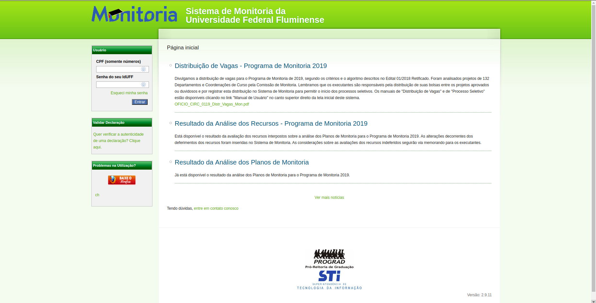
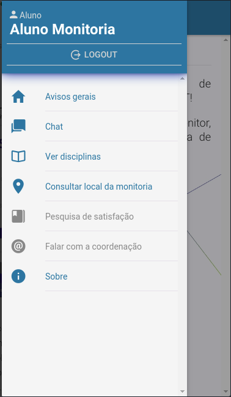

# BENCHMARKING

## Histórico de revisão

|   Data   | Versão |       Descrição       |                 Autor(es)                  |
| :------: | :----: | :-------------------: | :----------------------------------------: |
| 22/08/19 |   1.0  | Adiciona Benchmarking | [João Rodrigues](https://github.com/rjoao) |

## Introdução

Este documento tem por objetivo identificar as funcionalidades fundamentais para o produto que está sendo desenvolvido solucionar o problema proposto e ser maduro gerencial e operacionalmente.

## Benchmarking

### Definição

Em nosso contexto, o benchmarking foi utilizado como um processo de pesquisa para comparação das funcionalidades dos produtos concorrentes ou similares presentes no mercado.

### Concorrentes

| CONCORRENTES | PLATAFORMA |
| :----------: | :--------: |
| [MONITORIA - SISTEMA DE MONITORIA DA UNIVERSIDADE FEDERAL FLUMINENS (UFF)](https://app.uff.br/monitoria/) | WEB |
| [MONITORIA USJT (UNIVERSIDADE SÃO JUDAS TADEU)](https://play.google.com/store/apps/details?id=br.usjt.fabricadesoftwareusjt) | MOBILE (ANDROID) |

|            FUNCIONALIDADES             | MONITORIA UFF | MONITORIA UFJT |
| :------------------------------------: | :-----------: | :------------: |
|       ÁREA RESTRITA DE USUÁRIOS        |      Sim      |       Sim      |
|          CADASTRO DE MONITORES         |      Sim      |       Sim      |
|          SELEÇÃO DE MONITORES          |      Sim      |       Sim      |
|     CADASTRO DE ALUNOS MONITORADOS     |      Não      |       Sim      |
|     FEED DE NOTÍCIAS RELACIONADAS      |      Sim      |       Sim      |
|    CHAT ENTRE MONITOR E MONITORADO     |      Não      |       Sim      |
|      VISUALIZAÇÃO DE DISCIPLINAS       |      Não      |       Sim      |
|      CONSULTAR LOCAL DE MONITORIA      |      Não      |       Sim      |
|         AVALIAÇÃO DE MONITORES         |      Não      |       Sim      |
| VERIFICAÇÃO DE DOCUMENTOS RELACIONADOS |      Sim      |       Não      |

### Screenshot Monitoria UFF

### Screenshot Monitoria USJT

