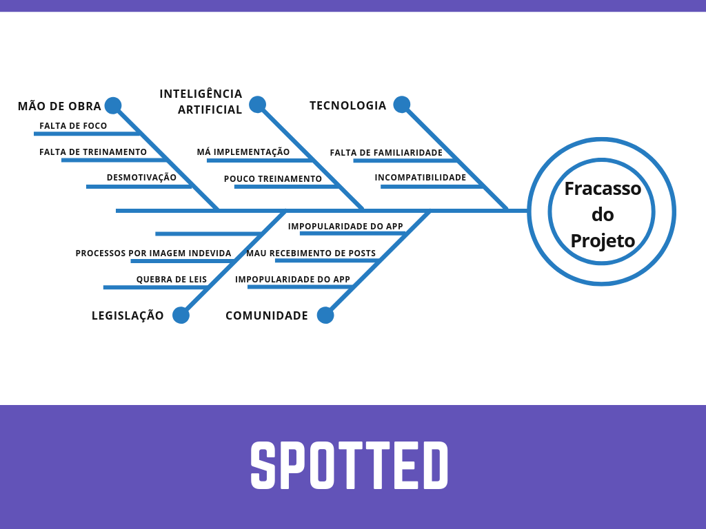
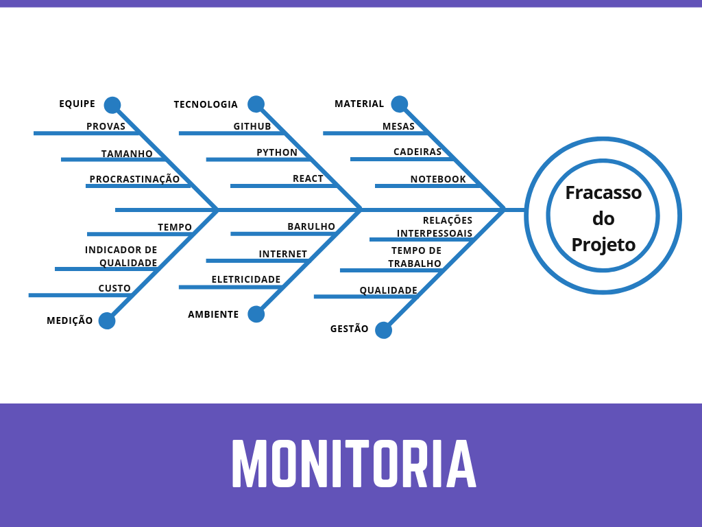

# Ishikawa - Definição de temas

## Histórico de revisão

| Data | Versão | Descrição | Autor(es)|
|:----:|:------:|:---------:|:--------:|
| 20/08/19 | 0.1 | Adição de introdução e Metodologia | [Rafael Makaha](http://github.com/rafaelmakaha) e [André Lucas](https://github.com/andrelucax) |
| 20/08/19 | 0.2 | Adição do modelo Ishikawa ao 3.1 - Spotted | [Rafael Makaha](http://github.com/rafaelmakaha) e [André Lucas](https://github.com/andrelucax) |
| 20/08/19 | 0.3 | Adição do modelo Ishikawa ao 3.3 - FreeLancer | [Lieverton Silva](https://github.com/lievertom) e [Welison Regis](https://github.com/WelisonR) | 
| 20/08/19 | 0.4 | Adição da definição | [Lieverton Silva](https://github.com/lievertom) |
| 21/08/19 | 0.5 | Adição do modelo Ishikawa ao 3.2 - Monitoria | [Paulo Vitor Rocha](https://github.com/PauloVitorRocha) e [João Rodrigues](https://github.com/rjoao) |

## Introdução

Este documento tem por objetivo explicitar os pontos de riscos para o desenvolvimento de cada tema do **Top 3** sugeridos pelo grupo 5 da disciplina de Arquitetura e Desenho de Software. Estes pontos serão apresentados por meio de Diagramas de Ishikawa - Diagrama Espinha de Peixe.

## Diagrama de Ishikawa
### Definição

No gerenciamento de projetos, assim como em qualquer área, existem problemas que podem ser solucionados definitivamente ao se conhecer as suas origens. Ou seja, para tratar o efeito é preciso entender as causas. Uma ferramenta bastante eficaz na solução de problemáticas de forma definitiva é o Diagrama de Ishikawa.

!!! info "Conceito de *Diagrama de Ishikawa*"
    Também conhecido como Diagrama de Causa e Efeito  ou Diagrama Espinha de Peixe,  o *diagrama Ishikawa* é uma ferramenta gráfica indicada para gerenciar e controlar a qualidade em diferentes processos dentro das empresas, possibilita investigar as verdadeiras causas dos problemas ou oportunidades de melhorias, mas vai além das causas principais e esmiúça também as causas secundárias.[^1]

## Metodologia

Para a elaboração dos Diagramas de Ishikawa foram utilizados os conhecimentos adquiridos na disciplina de Requisitos de Software da Universidade de Brasília, bem como os de Arquitetura e Desenho de Software.
Fora utilizada, também, a ferramenta [canva.com](https://www.canva.com) para a elaboração dos modelos, a seguir, apresentados.

## Modelos

### UnB Spotted

### Monitorias

### FreeLancer App

[^1]: CAMARGO, Robson. Diagrama de Ishikawa no gerenciamento de projetos. ROBSON CAMARGO, 20 jun. 2018. Disponível em: https://robsoncamargo.com.br/blog/Diagrama-de-Ishikawa-no-gerenciamento-de-projetos. Acesso em: 19 ago. 2019.