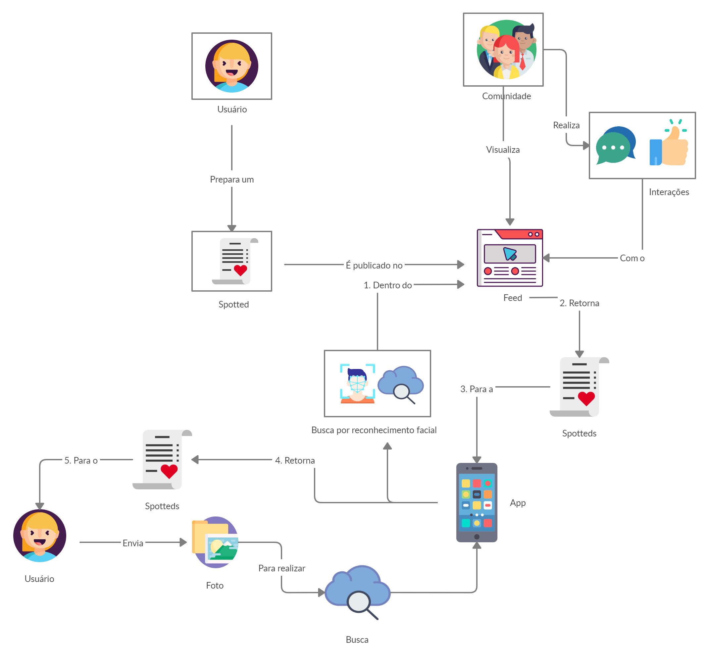
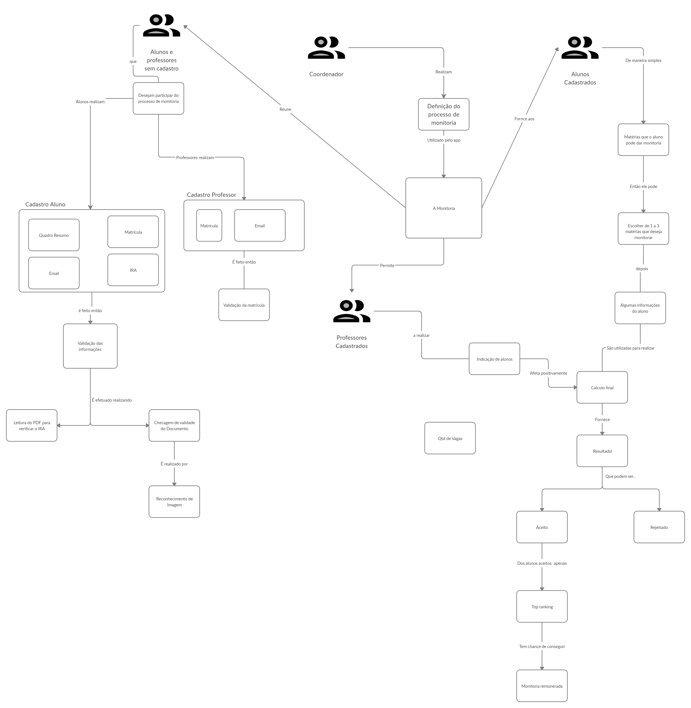
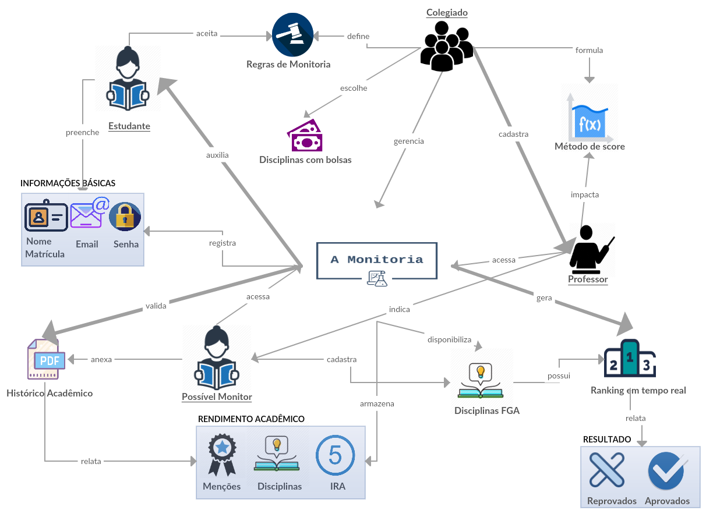
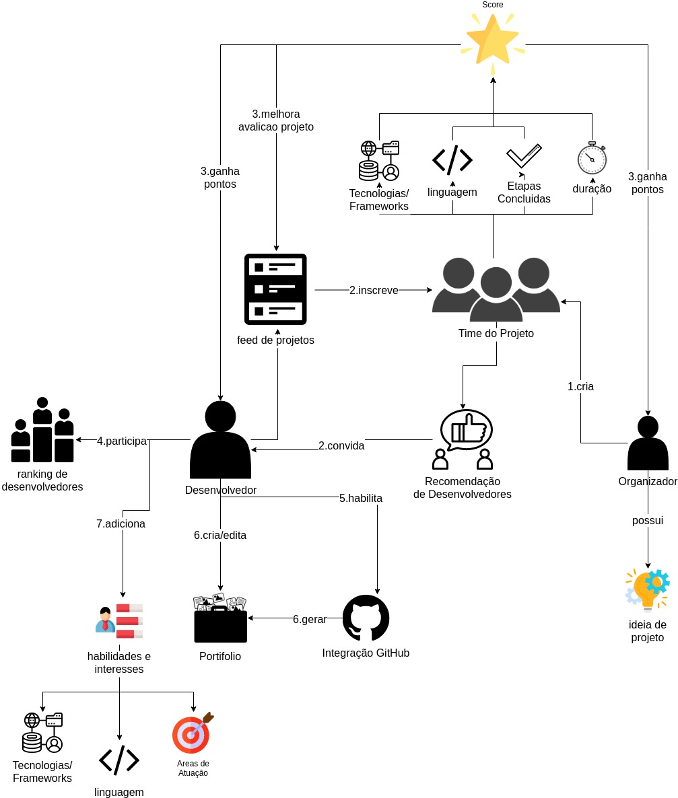

# Rich Picture

## Histórico de revisão

| Data | Versão | Descrição | Autor(es)|
|:----:|:------:|:---------:|:--------:|
|22/08/19|0.1|Adição de introdução e definição|[Ivan Dobbin](https://github.com/darmsDD)|
|22/08/19|0.2| Criação do RP Freelancer| [Lucas Maciel](lucasmacielaguiar@gmail.com) e [Leonardo Medeiros](https://github.com/leomedeiros1) 
|22/08/19|0.3| Criação do RP A Monitoria|[Ivan Dobbin](https://github.com/darmsDD) e [Welison Regis](https://github.com/WelisonR)
|22/08/19|0.4| Criação do RP Spotted|[João Rossi](https://github.com/bielrossi15) e [Gustavo Lima](https://github.com/gustavolima00)|
|22/08/19|0.5|Adição dos RP|[Ivan Dobbin](https://github.com/darmsDD)
|22/08/19|0.6| Adição da bibliografia de ícones e descrição de spotted |[João Rossi](https://github.com/bielrossi15) e [Gustavo Lima](https://github.com/gustavolima00)|

## Introdução
O objetivo deste documento é apresentar de maneira simples as ideias do **Top 3** temas discutidos anteriormente pelo grupo 5 da disciplina de Arquitetura e Desenho de Software. Essa apresentação será feito for Rich Pictures.

## Definição

Rich picture é uma ferramenta/modelagem para análise de problemas e apresentação de ideias. É um desenho de uma situação que ilustra os elementos principais e relações que precisam ser levadas em consideração ao tentar criar alguma melhoria. Consiste de fotos, textos, símbolos e ícones, no qual todos são utilizados para ilustrar graficamente a situação.

Um modelo completamente informal, normalmente criado sem um rigor muito técnico, visando poder ser criado junto com o próprio cliente, normalmente desenhado baseado em um problema central no meio de uma página em branco e criando tópicos relacionados com esse problema e as suas ramificações.

## Modelos

### UnB Spotted

Icones[^1]

!!! info "Conceito de Spotted"
    - Nome que se tornou popular para publicação de pessoas consistindo em foto de outra pessoa contendo uma texto, que geralmente é uma declaração.
    - Esse tipo de publicacação geralmente é ultilizada para chamar a atenção alguem que você deseja conversar e conhecer melhor, e dificilmente é acompanhada do nome dos envolvidos.

### Monitorias

#### Versão 1

#### Versão 2

### FreeLancer App

## Referências

[^1]: FLATICON. Free Vector Icons. Disponível em <https://www.flaticon.com/>. Acesso em: 22 de ago. de 2019
