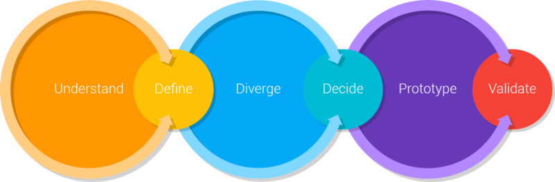
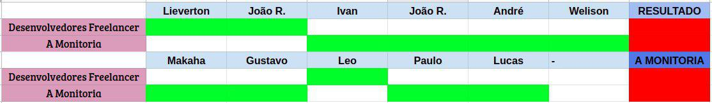

# DEFINIÇÃO DE TEMA

## Histórico de revisão

| Data | Versão | Descrição | Autor(es)|
|:----:|:------:|:---------:|:--------:|
| 18/08/19 | 0.1 | Adiciona Design Sprint | [Welison Regis](https://github.com/WelisonR) |
| 19/08/19 | 0.2 | Incrementa metologia e referências | [Welison Regis](https://github.com/WelisonR) |
| 22/08/19 | 0.3 | Adiciona tópicos de introdução e decisão do tema | [Lieverton Silva](https://github.com/lievertom) e [Welison Regis](https://github.com/WelisonR) |
| 23/08/19 | 0.4 | Incrementa mapa mental sobre metodologia e visão geral | [Welison Regis](https://github.com/WelisonR) |
| 23/08/19 | 0.5 | Coloca tópico de decisão de tema | [Welison Regis](https://github.com/WelisonR) |
| 23/08/19 | 0.6 | Descreve todos os detalhes acerca dos artefatos desenvolvidos | [Welison Regis](https://github.com/WelisonR) |

## Introdução

O atual documento utiliza-se da metodologia de **design sprint** proposta pela Google Ventures. A design sprint desenvolvida nesse documento possui dois principais objetivos: definir o tema adotado pelo grupo e começar a desenvolver as ideias e os artefatos iniciais do projeto escolhido e, para atingir tais objetivos, utiliza-se de recursos que dão suporte ao entendimento do problema, auxiliam a tomada de decisões e corroboram com o desenvolvimento do projeto.

## Metodologia e Visão Geral

## Design Sprint

### Definição

Decorrente da necessidade de alinhar o time de trabalho sob uma visão compartilhada de metas e resultados claramente definidos, e a ânsia da redução do tempo de produção de um produto, surgiu-se o conceito de *design sprint*.

!!! info "Conceito de *Design Sprint*"
    A *design sprint*, inicialmente proposta pela Google Ventures, é um método usado para resolver problemas por meio de idealização, prototipagem e teste de ideias em um curto espaço de tempo.[^1]

### Etapas

As etapas de uma Design Sprint podem ser classificadas como abaixo[^2]:

1. **Fase de entendimento** (understand): qual a necessidade do cliente ou da empresa? quais as capacidades tecnológicas?
2. **Fase de definição** (define): qual é a estratégia chave e o foco do produto?
3. **Fase de divergência** (diverge/sketch): como explorar o máximo de ideias distintas?
4. **Fase de decisão** (decide): selecione a melhor ideia até então.
5. **Fase de prototipação** (prototype): Crie artefatos que permitam testar as ideias com os usuários.
6. **Fase de validação** (validate): Teste as ideias com usuários, *stakeholders* e especialistas técnicos.

## Artefatos desenvolvidos

Por consenso, o grupo avaliou que seria mais prudente avaliar as três melhores ideias de projetos, disponíveis e votadas em [issue no GitHub](https://github.com/2019-2-arquitetura-desenho/wiki/issues/3), e então prosseguir com o desenvolvimento de um tema. Portanto, elencou-se as como as principais ideias os projetos **"UnB Spotted"**, **"Freelancer"** e **"A Monitoria"**. Abaixo consta os artefatos desenvolvidos para a devida tomada de decisão sobre o tema e, posteriormente, encontra-se artefatos produzidos que dão subsídio ao tema escolhido.

### Understanding, define, sketch 

Para melhor compreensão e definição dos temas propostos, reservou-se a aplicação da **fase understanding**, **fase define** e **fase sketch**. Portanto, para corroborar com o entendimento dos temas e a discussão coletiva, contruiu-se os **seguintes artefatos**:

!!! info "Clique sobre o nome para acessar o(s) artefato(s)"
    #### [Rich Picture](definicao_tema/rich_picture.md)

!!! info "Clique sobre o nome para acessar o(s) artefato(s)"
    #### [5W2H](definicao_tema/5W2H.md)

### Decision

Para a decisão sobre qual é a melhor ideia proposta, o grupo recorreu a uma reunião para a tomada de decisão. Teve-se como base da discussão as **causas** que poderiam acarretar no **fracasso do produto**, isto é, tentou-se responder a seguinte pergunta: "O que poderia causar o fracasso do produto?". Logo, elaborou-se os seguintes artefatos:

!!! info "Clique sobre o nome para acessar o(s) artefato(s)"
    #### [Diagrama de Ishikawa](definicao_tema/ishikawa.md)

#### Decisão do tema

Após a elaboração dos artefatos necessários para entender as sugestões de temas e os seus problemas, decidiu-se fazer uma reunião via [Discord](https://discordapp.com/) para a decisão do tema (aúdio disponível) e os artefatos a ser desenvolvidos.

!!! note "Aúdio de discussão e definição do tema"
    Aúdio de decisão do tema: [Decisão do Tema](https://drive.google.com/file/d/1bGG_nUY9GWlj-XK0XBhq0rTRqsmPBm56/view?usp=sharing).

    Tópicos abordados:

    *   Problematização acerca dos temas;
    *   Sugestões e discussões sobre as ideias propostas;
    *   Possíveis dificuldades que os projetos encontrariam;
    *   Votação do tema;
    *   Definição dos futuros artefatos elaborados.

A partir da discurssão realizada, chegou-se a conclusão da não atratividade sobre o projeto "Spotted", pois o escopo da aplicação não era interessante para o grupo, além de questões acerca da aplicabilidade da ideia em relação ao processamento (*match*) de perfis faciais de pessoas.

Portanto, a escolha final foi baseada sobre os temas mais viáveis: "A monitoria" e "Freelancer". Conforme votação abaixo, a aplicação desenvolvida será "A monitoria" com 8 votos de um total de 11 participantes.

### Prototype e Validate

Após definido o tema, o grupo partiu para uma análise minuciosa acerca das necessidades e requisitos que abarcam a aplicação pretendida. Portanto, procurou-se analisar as **ideias e soluções dos concorrentes** através de um benchmarking:

!!! info "Clique sobre o nome para acessar o(s) artefato(s)"
    #### [Benchmarking](benchmarking.md)

Além disso, procurou-se **opiniões e sugestões do público-alvo** (estudantes da FGa, Gama) através de um formulário, disponibilizado em grupos da faculdade. A prévia do formulário pode ser conferida clicando no seguinte link:

!!! info "Clique sobre o nome para acessar o(s) artefato(s)"
    #### [Questionário](Elicitacao/questionario.md)

Para alinhar o time que participa no atual projeto, desenvolveu-se um documento de visão com o objetivo de melhor definir uma **visão geral dos fatores que circundam a aplicação**. Documento de visão:

!!! info "Clique sobre o nome para acessar o(s) artefato(s)"
    #### [Documento de visão](../documento_visao.md)

Por fim, realizou-se uma última reunião para definir constantes de custo e demais questões relacionadas a **estimativa de custo através método COCOMO**. Estimativas de custo:

!!! info "Clique sobre o nome para acessar o(s) artefato(s)"
    #### [Estimativas de custo](estimativas_de_custo.md)

Tendo como base toda a discussão acima, pode-se elaborar uma primeira versão de um protótipo do que se pensa sobre a aplicação no presente momento (23/08/2019). Protótipo do projeto "A Monitoria":

!!! info "Clique sobre o nome para acessar o(s) artefato(s)"
    #### [Protótipo de baixa fidelidade](Elicitacao/prototipo.md)

## Referências

[^1]: DESIGN SPRINT ACADEMY. . In: DESIGN SPRINT ACADEMY. What is a Design Sprint. [S. l.]: Design Sprint Academy, 8 jan. 2019. Disponível em: https://designsprint.academy/design-sprint-3-0/. Acesso em: 19 ago. 2019.

[^2]: DIREKOVA, Nadya. Design Sprint Methods: Playbook for start ups and designers. Mountain View: [s. n.], 2015. Disponível em: https://www.garage2020.nl/wp-content/uploads/2017/01/DesignSprintMethods.pdf. Acesso em: 19 ago. 2019.