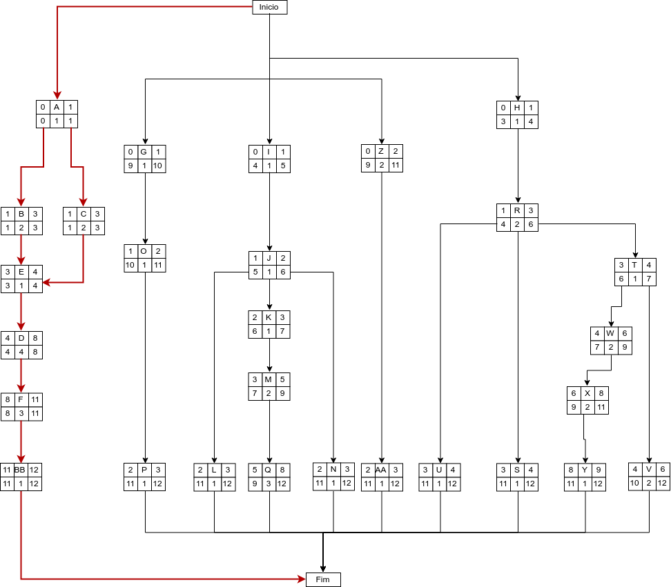

# CONTROLE DE RISCOS

## Histórico de Revisão
| Data | Versão | Descrição | Autor(es) |
| :--: | :----: | :-------: | :-------: |
| 22/08/19 | 0.1 | Criação do documento, indicação de tópicos e referências | [Lieverton Silva](https://github.com/lievertom) e [Welison Regis](https://github.com/WelisonR) |
| 01/09/19 | 1.0 | Adição da Descrição dos Itens da Estrutura analítica de Risco |  [Andre Pinto](https://github.com/andrelucax) e  [Leonardo Medeiros](https://github.com/leomedeiros1) |
| 01/09/19 | 1.1 | Adição da Análise quantitativa dos riscos |  [Andre Pinto](https://github.com/andrelucax) e  [Leonardo Medeiros](https://github.com/leomedeiros1) |
| 05/09/19 | 2.0 | Adição das Matrizes de impacto |  [Andre Pinto](https://github.com/andrelucax) e  [Leonardo Medeiros](https://github.com/leomedeiros1) |
| 05/09/19 | 3.0 | Adição da tabela para o PERT/CPM |  [Andre Pinto](https://github.com/andrelucax) e  [Leonardo Medeiros](https://github.com/leomedeiros1) |
| 05/09/19 | 3.1 | Adição do diagrama PERT/CPM |  [Andre Pinto](https://github.com/andrelucax) e  [Leonardo Medeiros](https://github.com/leomedeiros1) |
| 05/09/19 | 2.0 | Adição da análise do Diagrama PERT/CPM |  [Andre Pinto](https://github.com/andrelucax) e  [Leonardo Medeiros](https://github.com/leomedeiros1) |

## Introdução

O objetivo deste documento é explicitar como acontecerá o gerenciamento de riscos. O gerenciamento de riscos está incluso no processo de gerenciamento de projeto que inclui, além dos riscos, pessoas, custos, escopo, etc. O documento define como serão identificados, mantidos e controlados todos os riscos previstos.

## Estrutura Análitica de Riscos

### Descrição dos Itens da Estrutura analítica de Risco

#### Organizacional
- **Recursos Humanos**: Corresponde aos riscos relacionados aos recursos humanos, bem como o comprometimento da equipe de desenvolvimento e falta de comunicação entre as partes envolvidas.
- **Priorização**: São riscos relacionados aos erros de priorização, gerando atrasos nas entregas, por existir dependências entre as tarefas.

#### Técnico
- **Requisitos**: Riscos relacionados aos requisitos levantados e ao escopo definido;
- **Tecnologia**: É relativo a riscos relacionados às tecnologias e ferramentas utilizadas no projeto.
- **Infraestrutura**: Um dos pontos mais críticos do gerenciamento de riscos em projetos de software, pois geralmente nos esquecemos de providenciar com antecedência a infraestrutura onde o software será executado. É um ponto crítico de conflitos entre a área de infraestrutura, suporte e desenvolvimento.

#### Qualidade
- **Funcionalidade**: Contempla tudo relacionado à funcionalidade do software, como garantir que os requisitos foram atendidos de forma satisfatória, garantir que atende a real necessidade do usuário e se retornará resultados precisos.
- **Usabilidade**: A usabilidade engloba todos os aspectos referentes à interface com o usuário, que se sinta a vontade com o uso do sistema e que o entenda, com o mínimo de treinamento.
- **Eficiência**: Garantir que o usuário consiga ter as respostas da aplicação de forma rápida e coesa.
- **Portabilidade**: Se refere a que plataformas/sistemas operacionais o software irá rodar e como será feita a compatibilidade.

#### Gerencia de projeto
- **Planejamento**: São riscos relacionados a erros de planejamento, como tarefas grandes em períodos curtos.
- **Estimativa**: São erros que dizem respeito a erros de estimativa, como por exemplo erros de pontuação de histórias de usuário.
- **Controle**: São riscos referentes a falta de ação sobre riscos identificados.

#### Externos
- **Mercado**: Baixa adesão dos usuários a aplicação, risco relacionado à utilização e evolução do projeto no mercado.
- **Cliente**: Diz respeito aos riscos relacionados com o cliente, como aprovação da solução. No caso do "A Monitoria" a sazonalidade do uso do produto pode representar um risco.
- **Ambiente**: O ambiente pode influenciar no desempenho da equipe e no desenvolvimento do produto, um exemplo aplicado ao nosso projeto é o fato de a maior parte do desenvolvimento acontecer na FGA e uma das limitações que pode ocorrer é a falta da internet ou a realização greves.

## Análise quantitativa dos riscos
A análise quantitativa dos riscos será feita através da matriz de probabilidade e impacto, cada risco é classificado de acordo com a sua probabilidade de ocorrência e impacto em um objetivo, se ele realmente ocorrer. A organização deve determinar que combinações de probabilidade e impacto resultam em uma classificação de alto risco, risco moderado e baixo risco.

### Probabilidade
| Probabilidade | Peso |
| :-----------: | :--: |
| Muito Baixa | 1 |
| Baixa	| 2 |
| Média | 3 |
| Alta | 4 |
| Muito Alta | 5 |

### Impacto
| Impacto | Descrição | Peso |
| :-----: | :-------: | :--: |
| Muito Baixo |	Quase imperceptível para o projeto | 1 |
| Baixo	| Emite pouco impacto sobre o projeto |	2 |
| Médio | Existe um impacto considerável, mas é recuperável |	3 |
| Alto | Existe grande impacto no projeto | 4 |
| Muito Alto | Impede o prosseguimento do projeto | 5 |

### Prioridade
| P/I | Muito Baixo  | Baixo | Médio | Alto | Muito Alto |
| :-: | :----------: | :---: | :---: | :--: | :--------: |
| Muito Baixa |	1 | 2 | 3 | 4 | 5 |
| Baixa	| 2 | 4 | 6 | 8 | 10 |
| Média | 3 | 6 | 9 | 12 | 15 |
| Alta | 4 | 8 | 12 | 16 | 20 |
| Muito Alta | 5 | 10 | 15 | 20 | 25 |

## Matrizes de impacto

### Riscos organizacionais
| Risco | Impacto | Probabilidade | Prevenção | Resposta | Prioridade |
| :---: | :-----: | :-----------: | :-------: | :------: | :--------: |
| Falta de comprometimento ou desistência da disciplina por algum integrante da equipe | Muito Alto | Media | Ações para motivar os membros | Replanejamento de atividades, visando deixar os membros mais confortáveis | 15 |
| Priorização de atividades pouco relevantes | Alto | Baixa | Seguir o Sprint Backlog | Reforçar a importância da execução das tarefas previstas | 8 |
| Falta de comunicação entre os membros da equipe | Alto | Muito Baixa | Utilizar meios de comunicação que a equipe já está acostumada | Avaliar a eficiência dos canais de comunicação utilizados, e se necessário, incorporar novos meios de comunicação | 4 |

### Riscos técnicos
| Risco | Impacto | Probabilidade | Prevenção | Resposta | Prioridade |
| :---: | :-----: | :-----------: | :-------: | :------: | :--------: |
| Dificuldade de Identificar requisitos | Muito Alto | Baixa | Utilizar diversas técnicas para elicitar requisitos | Refinar e replanejar obtenção de requisitos | 10 |
| Baixo dominio das tecnologias | Médio | Baixa | Realizar estudos indivuais sobre as tecnologias a serem usadas. | Pareamento visando troca de conhecimento | 6 |
| Atraso na conclusão das atividades | Alto | Média |Mensurar previamente o nivel de conhecimento individual dos membros sobre as tecnologias usadas, evitando sobrecarga | Revisão da forma de planejamento das atividades | 12 |

### Riscos de Qualidade
| Risco | Impacto | Probabilidade | Prevenção | Resposta | Prioridade |
| :---: | :-----: | :-----------: | :-------: | :------: | :--------: |
| Ausência de testes | Muito Alto | Alta | Realização dos testes automatizados na aplicação e alta prioridade para os mesmos | Realização emergêncial de outros tipos de testes | 20 |
| Falhas e bugs na aplicação | Muito Alto | Media | Realização de testes e dupla verificação nos códigos adicionados ao repositórios | Refatoração das features defeituosas | 15 |

### Riscos de Gerência de projeto
| Risco | Impacto | Probabilidade | Prevenção | Resposta | Prioridade |
| :---: | :-----: | :-----------: | :-------: | :------: | :--------: |
| Escopo mal definido | Muito Alto | Baixa | Adequar o escopo para o tempo dispónivel | Redefinir Escopo | 10 |
| Cronograma inviável | Muito Alto | Baixa | Adequar os prazos e atividades a um escopo viável | Refatorar o Cronograma | 10 |
| Problemas no autogerenciamento da equipe | Muito Alto | Media | Membros da equipe devem estar cientes de seu papel dentro da equipe, e a importância do seu comprometimento | Cobrança mútua por parte da equipe | 15 |

### Riscos Externos
| Risco | Impacto | Probabilidade | Prevenção | Resposta | Prioridade |
| :---: | :-----: | :-----------: | :-------: | :------: | :--------: |
| Baixa adesão da aplicação | Alto | Alta | Realização de pesquisas com o público alvo | Adaptação da aplicação de acordo com o solicitado pelo público alvo | 16 |
| Baixo uso da aplicação, devido à sazonalidade com que o processo ocorre | Alto | Muito Alta | - | - | 20 |

## Caminho Crítico com PERT/CPM

### Tabela

| Atividade | Descrição | Precedentes | Duração |
| :-------: | :-------: | :---------: | :-----: |
| A | Diagrama BPMN | - | 1 |
| B | Modelos Estáticos UML | A | 2 |
| C | Modelos Dinâmicos UML | A | 2 |
| D | Padrões GoFs | E | 4 |
| E | Padrões Emergentes | B, C | 1 |
| F | Documento de Arquitetura | D | 3 |
| G | Documento de Visão | - | 1 |
| H | Protótipo | - | 1 |
| I | Modelar Banco de Dados | - | 1 |
| J | Conectar Banco de Dados | I | 1 |
| K | Aplicar Padrões de Requisição com Arquitetura REST | J | 1 |
| L | Armazenar Informações do Cadastro do Usuário | J | 1 |
| M | Extração de Informções do PDF | K | 2 |
| N | Criação de Super Usuário | J | 1 |
| O | Definição de Regras de Monitoria | G | 1 |
| P | Aplicação da Formula | O | 1 |
| Q | Desenvolver Extração do Nome, IRA e Matérias Cursadas | M | 3 |
| R | Tela de Login | H | 2 |
| S | Tela de Ajuda ao Aluno | R | 1 |
| T | Menu Lateral | R | 1 |
| U | Alterar Cadastro | R | 1 |
| V | Enviar PDF | T | 2 |
| W | Tela com Matérias Disponíveis para Inscrição | T | 2 |
| X | Tela de Resultado da Monitoria em Tempo Real | W | 2 |
| Y | Professor Selecionar Alunos para Resultado | X | 1 |
| Z | Desenvolver Extração de Matérias, Turmas e Horários | - | 2 |
| AA | Exportar Dados para o back-end em Formato Compatível | Z | 1 |
| BB | Revisão dos Artefatos | F | 1 |

### Diagrama

### Análise

De acordo com o diagrama acima é possivel visualizar que o caminho crítico do projeto está relacionado com os artefatos que são os fundamentos de um desenvolvimento saudavel de um projeto. Com isso é fácil notar que o atraso dos artefatos acarretaria no atraso do projeto, devendo ter uma maior prioridade.

## Referências

[^1]: https://desenhosoftware-2018-2.github.io/wiki/gerenciamentoRiscos
[^2]: https://desenhosoftware-2018-2.github.io/wiki/monitoramentoRiscos
[^3]: https://danielettinger.com/2011/06/14/gerenciando-os-riscos-do-projeto-com-a-matriz-de-probabilidade-e-impacto/
[^4]: https://github.com/Desenho-Grupo2/PlanUp/wiki/Plano-de-Gerenciamento-de-Riscos
[^5]: https://www.lucidchart.com/pages/pt/caminho-critico-e-graficos-pert
[^6]: https://www.youtube.com/watch?v=0EWnD4StjMQ
[^7]: https://www.youtube.com/watch?v=7IGoH6M41V8
