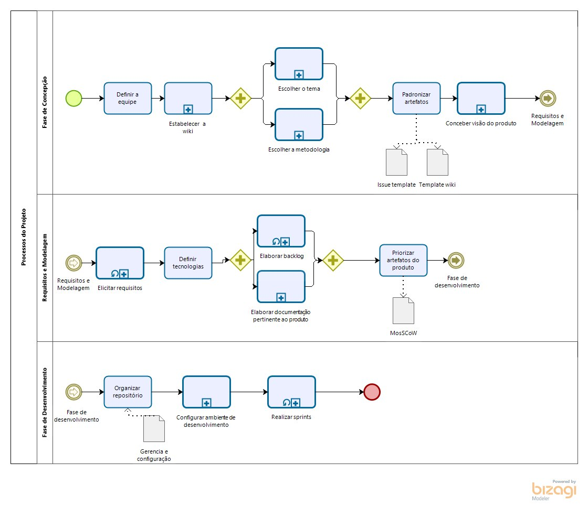
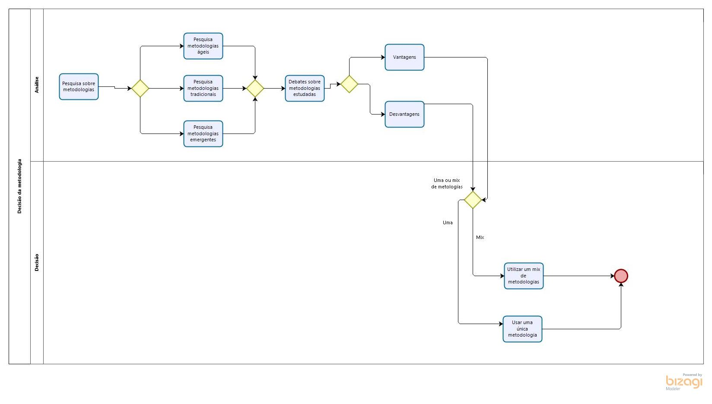
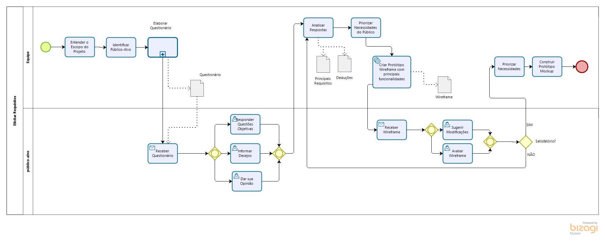
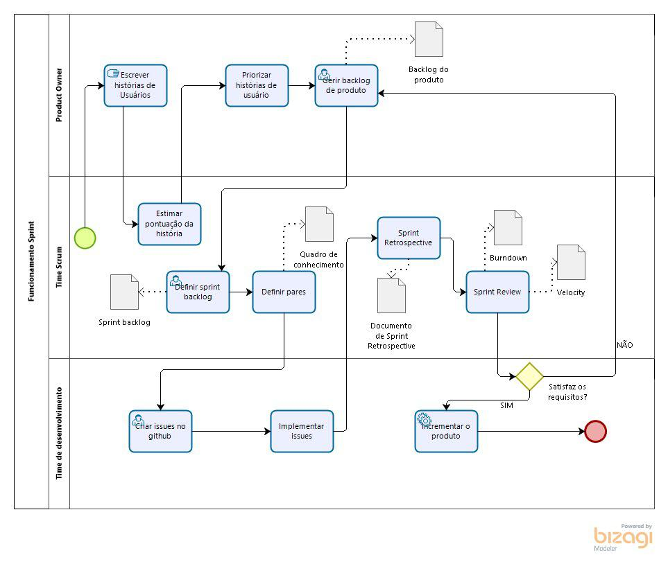
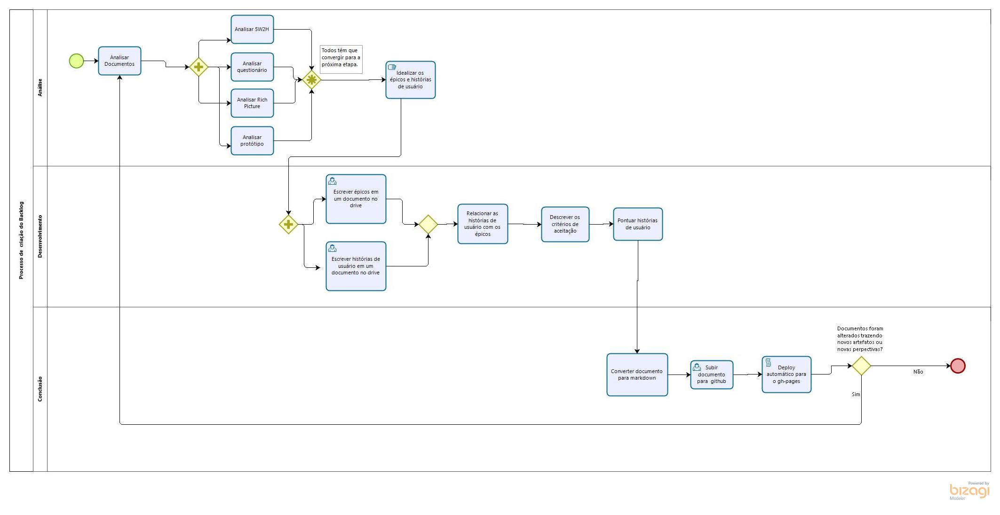
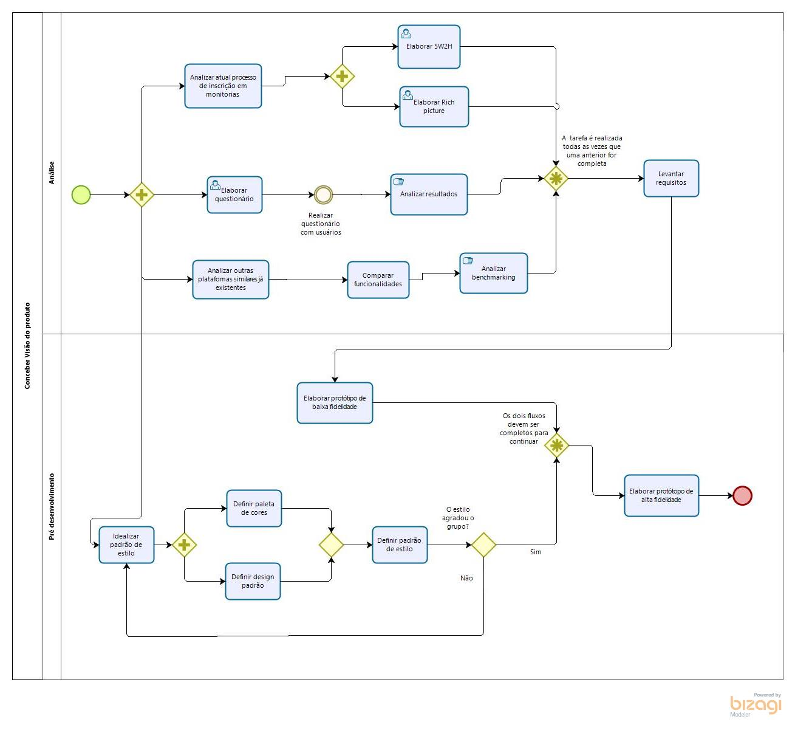

# DIAGRAMAS BPMN

## Histórico de Revisão
| Data | Versão | Descrição | Autor(es)|
|:----:|:------:|:---------:|:--------:|
| 01/09/19 | 0.1 | Adição da descrição | [Gustavo Lima](https://github.com/gustavolima00) e [Ivan Dobbin](https://github.com/darmsDD)|
| 01/09/19 | 0.2 | Adicão do diagrama geral do processo de trabalho | [Lieverton Silva](https://github.com/lievertom) e [Welison Regis](https://github.com/WelisonR) |
| 01/09/19 | 0.2 | Criação do diagrama de escolha do tema | [Gustavo Lima](https://github.com/gustavolima00) e [Ivan Dobbin](https://github.com/darmsDD)|
| 01/09/19 | 0.3 | Criação do diagrama de escolha da metodologia | [Gustavo Lima](https://github.com/gustavolima00) e [Ivan Dobbin](https://github.com/darmsDD)|
| 02/09/19 | 0.4 | Adicão do diagrama geral do processo de trabalho v2 | [Lieverton Silva](https://github.com/lievertom) e [Welison Regis](https://github.com/WelisonR) |
| 04/09/19 | 0.5 | Adição do diagrama de Elicitar Requisitos | [Lucas Aguiar](https://github.com/Ridersk) |
| 05/09/2019 | 0.6 | Adição do diagrama da sprint | [Lieverton Silva](https://github.com/lievertom) e [Welison Regis](https://github.com/WelisonR) |
| 05/09/2019 | 0.7 | Adição do diagrama do processo de criação do backlog | [Gustavo Lima](https://github.com/gustavolima00) e [Ivan Dobbin](https://github.com/darmsDD)|
| 05/09/2019 | 0.8 | Adição do diagrama de conceber visão do produto | [Gustavo Lima](https://github.com/gustavolima00) e [Ivan Dobbin](https://github.com/darmsDD)|

## Introdução

Aqui estão listados diagramas modelados com o auxílio do software modelador Bizagi, que demonstram a organização baseada em tarefas ultilizada pelo grupo para elaborar determinados processos

## Diagramas BPMN

### Diagrama Geral

#### Versão 1.0

#### Versão 2.0

## Decisão do tema 

## Decisão da metodologia

## Elicitar Requisitos

## Sprints

## Processo de criação do Backlog

## Conceber visão do produto

