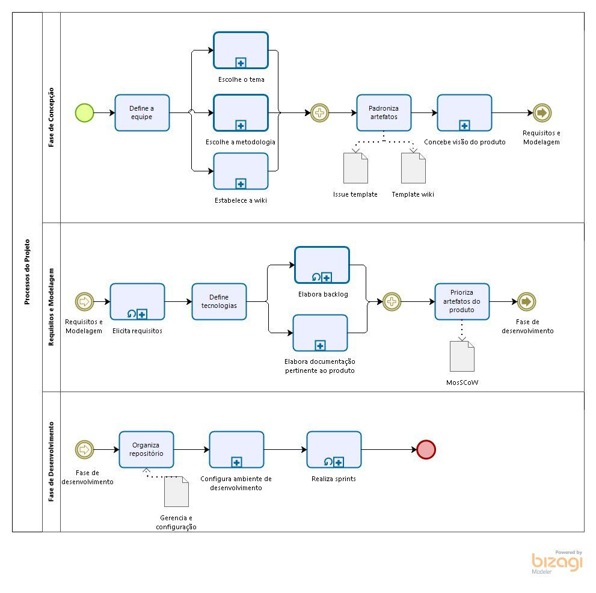
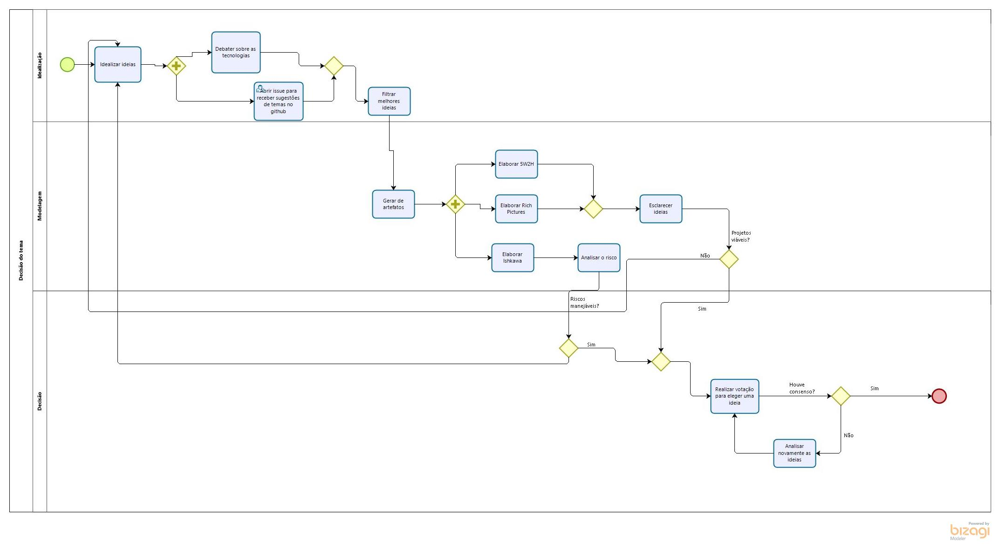

# DIAGRAMAS BPMN

## Histórico de Revisão
| Data | Versão | Descrição | Autor(es)|
|:----:|:------:|:---------:|:--------:|
| 01/09/19 | 0.1 | Adição da descrição | [Gustavo Lima](https://github.com/gustavolima00) e [Ivan Dobbin](https://github.com/darmsDD)|
| 01/08/19 | 0.2 | Adicão do diagrama geral do processo de trabalho | [Lieverton Silva](https://github.com/lievertom) e [Welison Regis](https://github.com/WelisonR) |
| 01/09/19 | 0.2 | Criação do diagrama de escolha do tema | [Gustavo Lima](https://github.com/gustavolima00) e [Ivan Dobbin](https://github.com/darmsDD)|
| 01/09/19 | 0.3 | Criação do diagrama de escolha da metodologia | [Gustavo Lima](https://github.com/gustavolima00) e [Ivan Dobbin](https://github.com/darmsDD)|

## Introdução

Aqui estão listados diagramas modelados com o auxílio do software modelador Bizagi, que demonstram a organização baseada em tarefas ultilizada pelo grupo para elaborar determinados processos

## Diagramas BPMN

### Diagrama Geral

## Decisão do tema 

## Decisão da metodologia

