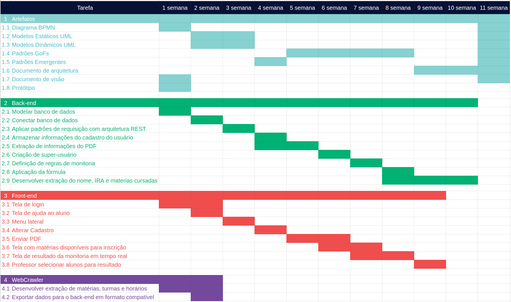

# CONTROLE DE RISCOS

## Histórico de Revisão
| Data | Versão | Descrição | Autor(es)|
|:----:|:------:|:---------:|:--------:|
| 30/08/19 | 0.1 | Criação do documento, indicação de tópicos e referências | [Lieverton Silva](https://github.com/lievertom) e [Welison Regis](https://github.com/WelisonR) |
| 02/09/19 | 0.2 | Criação do diagrama de Gantt | [Paulo Vitor](https://github.com/paulovitorrocha) e [João Rossi](https://github.com/bielrossi15)|
| 02/09/19 | 0.3 | Introdução sobre o diagrama | [Paulo Vitor](https://github.com/paulovitorrocha) e [João Rossi](https://github.com/bielrossi15)|
| 05/09/19 | 0.4 | Diagrama versao 2 | [Paulo Vitor](https://github.com/paulovitorrocha) e [João Rossi](https://github.com/bielrossi15)|

## Introdução
O diagrama de Gantt é um artefato visual para controlar cronogramas de projetos, com o objetivo de ajudar e avaliar prazos de entrega da equipe.  

## Metodologia
Nós utilizaremos o diagrama com o objetivo citado em cima, com o foco em conciliar diferentes partes do projeto que necessitam caminhar com a mesma velocidade para não se perder, sendo elas: 
  
- Backend  
  
- Frontend  
  
- Web Crawler  
  
- Artefatos  

O documento será evoluído conforme o andamento do projeto e a percepção do grupo sobre a necessidade de adiantar e adiar prazos em certas partes.

## Diagrama
### versão 1.0

### versão 2.0

## Referências 

[^1]: https://ads-unigrade-2019-1.github.io/Wiki/dinamica02/DiagramaGantt/
[^2]: https://www.nomus.com.br/blog-industrial/grafico-de-gantt/