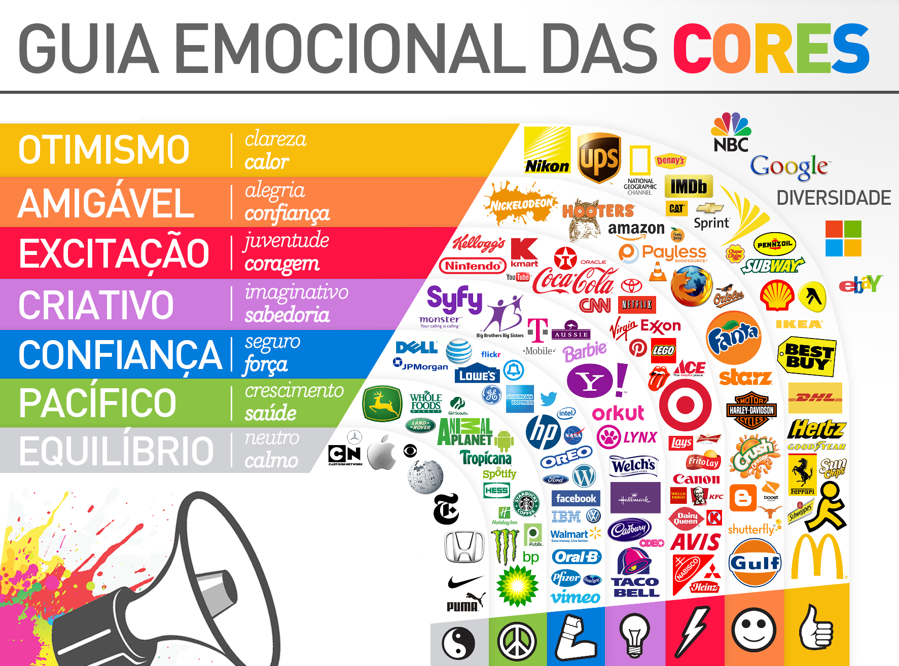

# Identidade Visual

## 1. Introdução

A Identidade Visual representa a familiarização das pessoas com o projeto. As cores presentes em uma logo ou em um aplicativo influenciam diretamente no humor e aceitação dos que as vêem. 

## 2. Paleta de Cores

## 3. Cores e Emoções

Cada cor pode transmitir uma emoção direta para o alvo que a vê. Como a proposta do projeto é relacionada ao campo educacional, a equipe optou por selecionar cores voltadas a segurança e sabedoria.

Explicaremos o porque da escolha de cada cor:

- Azul: Azul é uma cor calma, que facilita a execução de tarefas mentais e, principalmente, não cansa os olhos.
- Branco : O branco é uma cor padrão, ótima para dar um contraste e servir como plano de fundo para não atrapalhar a conjuntura total das cores utilizadas
- Roxo : O roxo é uma cor que combina bem com o azul, contrastando com a calma que o azul transmite, sendo um pouco mais escura, traz o contraste entre cores mais claras e calmas.
- Preto : Assim como o branco, é uma cor padrão, sendo necessária para complementar as outras em alguns momentos.

