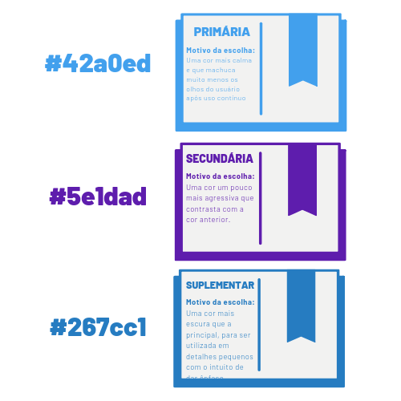

# Identidade Visual

## Histórico de Revisãp

| Data | Versão | Descrição | Autor(es)|
|:----:|:------:|:---------:|:--------:|
| 01/09/19 | 0.1 |  Criação do documento | [Rafael Makaha](http://github.com/rafaelmakaha)  |
| 05/09/19 | 0.2 | Explicação das cores | [João Rossi](https://github.com/bielrossi15) |
| 05/09/19 | 0.3 | Método de geração da paleta | [João Rossi](https://github.com/bielrossi15) |
| 05/09/19 | 0.4 | Análise de cores | [João Rossi](https://github.com/bielrossi15) |
| 17/11/19 | 0.5 | Análise de fonte e logo | [João Rossi](https://github.com/bielrossi15) |

## 1. Introdução

A Identidade Visual representa a familiarização das pessoas com o projeto. As cores presentes em uma logo ou em um aplicativo influenciam diretamente no humor e aceitação dos que as vêem.

## 2. Paleta de Cores

As cores da nossa paleta foi montada na plataforma [coolors](https://coolors.co/), em que geramos paletas e depois modificamos a mesma com base na opinião pessoal da pessoa que está por trás da montagem da paleta.

### Análise das cores principais

Aqui fizemos uma rápida análise com uma mostra gráfica das cores, antes de explicarmos o uso delas mais detalhadamente.

## 3. Cores e Emoções

Cada cor pode transmitir uma emoção direta para o alvo que a vê. Como a proposta do projeto é relacionada ao campo educacional, a equipe optou por selecionar cores voltadas a segurança e sabedoria, além de possibilitarem o usuário a utilizar a plataforma por um maior periodo de tempo sem cansar muito sua vista.

## 4. Motivos da escolha de cada cor

Explicaremos o porque da escolha de cada cor:

- Azul (#42a0ed, #267cc1): Azul é uma cor calma, que facilita a execução de tarefas mentais e, principalmente, não cansa os olhos.
  
- Branco (#ffffff): O branco é uma cor padrão, ótima para dar um contraste e servir como plano de fundo para não atrapalhar a conjuntura total das cores utilizadas
  
- Roxo (#5e1dad): O roxo é uma cor que combina bem com o azul, sendo uma cor mais elegante e enigmática, contrastando com a calma que o azul transmite.
  
- Preto (#141414): Assim como o branco, é uma cor padrão, sendo necessária para complementar as outras em alguns momentos.

## Fontes

O estudo das fontes é um ponto importante para o design de um produto, sendo motivo de pesquisas na área. Com isso, a equipe decidiu escolher uma fonte comum, para o usuário se sentir familiarizado com a mesma.

## Logo

A equipe separou uma pessoa para montar o logo e deixá-lo com as cores já selecionadas, além de dar um significado para o logo baseado no funcionamento e utilização do produto. 

A logo possui 3 partes, sendo um livro fechado nos tons de azul citados neste documento e uma caneta nos tons de roxo e preto também citados neste documento, e em alguns lugares ela também aparece com o nome do produto.

 A montagem e escolha de elementos para a logo é bem auto-explicativa, pois se trata de um produto focado na área da educação, aonde os elementos (livro e caneta) se encontram brem presentes, trazendo uma sensação de familiaridade para o usuário que se encontra no meio aonde o produto será utilizado.

## Referências 

[^1]: https://medium.com/@rafaelfrota/psicologia-das-cores-2262f5e5e00c
