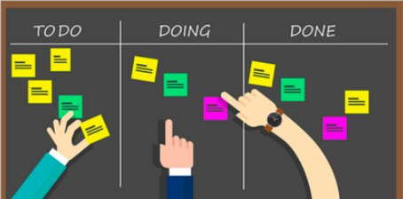

# METODOLOGIA

## Histórico de Revisão

| Data | Versão | Descrição | Autor(es)|
|:----:|:------:|:---------:|:--------:|
| 01/09/19 | 0.1 |  Criação do documento, indicação de tópicos e referências | [Lieverton Silva](https://github.com/lievertom) e [Welison Regis](https://github.com/WelisonR) |
| 01/09/19 | 0.2 | Adiciona scrum | [Lieverton Silva](https://github.com/lievertom) e [Welison Regis](https://github.com/WelisonR) |
| 01/09/19 | 0.3 | Adiciona kanban | [Lieverton Silva](https://github.com/lievertom) e [Welison Regis](https://github.com/WelisonR) |
| 01/09/19 | 0.4 | Adiciona burndown e velocity | [Lieverton Silva](https://github.com/lievertom) e [Welison Regis](https://github.com/WelisonR) |
| 01/09/19 | 0.5 | Adiciona quadro de conhecimento e metodologia montada | [Lieverton Silva](https://github.com/lievertom) e [Welison Regis](https://github.com/WelisonR) |
| 05/09/19 | 0.6 | Adiciona BPMN de sprint |  [Lieverton Silva](https://github.com/lievertom) e [Welison Regis](https://github.com/WelisonR) |

## Introdução

O presente documento busca definir e formalizar as metodologias de trabalho a ser aplicadas no desenvolvimento do projeto. Nesse sentido, estabelece-se abaixo as metodologias pertinentes ao escopo de elaboração da aplicação, como pode-se citar o **scrum, kanban, extreme programming** e, também, as metodologias de gerência, como, por exemplo, **reuniões, quadro de conhecimento e avaliações de desempenho com burndown, velocity**.

## Metodologias de desenvolvimento

### Scrum

Scrum é uma **metodologia ágil** voltada para gestão e planejamento de projetos de software.

No Scrum, os projetos são dividos em ciclos (tipicamente mensais), conhecidos como **sprints**. O Sprint representa um espaço de tempo dentro do qual um conjunto de atividades devem ser executadas. Metodologias ágeis de desenvolvimento de software são iterativas, ou seja, o trabalho é dividido em iterações, que são chamadas de Sprints no caso do Scrum.[^1]

A metodologia scrum define a utilização de um product backlog, o qual contém as funcionalidades a serem implementadas no projeto. No início de cada Sprint, faz-se um Sprint **Planning Meeting**, ou seja, uma reunião de planejamento na qual o Product Owner prioriza os itens do Product Backlog e a equipe seleciona as tarefas que ela será capaz de implementar durante o Sprint que se inicia. As tarefas alocadas em um Sprint são transferidas do **Product Backlog** para o Sprint Backlog.

Durante os dias de uma sprint, a equipe faz uma breve reunião (normalmente de manhã), chamada **Daily Scrum**. O objetivo é propagar o conhecimento sobre o que foi feito no dia anterior, identificar impedimentos e priorizar o trabalho do dia que se inicia.

Ao final de um Sprint, a equipe apresenta as funcionalidades implementadas em uma **Sprint Review Meeting**. Finalmente, faz-se uma **Sprint Retrospective** e a equipe parte para o planejamento do próximo Sprint. Assim reinicia-se o ciclo.

### Kanban

Kanban é uma metodologia que se utiliza de **cartões** (post-it e outros) para indicar o andamento dos **fluxos de produção.**

Nesses cartões são colocadas indicações sobre uma determinada tarefa, por exemplo, “para executar”, “em andamento” ou “finalizado”.

A utilização de um sistema Kanban permite um controle detalhado de produção com informações sobre quando, quanto e o que produzir.

### Extreme Programming (XP)

A Extreme Programming (XP) é uma Metodologia Ágil para equipes pequenas e médias que desenvolvem software baseado em requisitos vagos e que se modificam rapidamente. Entre as principais diferenças da XP em relação às Metodologias Clássicas estão o **feedback constante**, **a abordagem incremental** e **o encorajamento da comunicação entre as pessoas**.

Entre as **principais práticas do XP**, pode-se citar:
planejamento, entregas frequentes, metáfora, projeto simples, testes, programação em pares, refatoração, propriedade coletiva, integração contínua, cliente presente e padronização do código.

As práticas são conduzidas respeitando alguns **princípios**: princípio da comunicação, princípio da simplicidade, princípio do feedback e o princípio da coragem.

## Metodologias de gerência

### Burndown

Um gráfico de burndown é uma representação gráfica do **trabalho a ser feito versus tempo**. O trabalho restante (ou backlog) é geralmente no eixo vertical, com o tempo no eixo horizontal. É útil para prever quando todo o trabalho será concluído, frequentemente usado em metodologias ágeis de desenvolvimento de software, como o Scrum.

### Velocity

O velocity é uma medida que evidência a **velocidade do time para um projeto Scrum**. Esse número é calculado e atualizado após a entrega de cada sprint e baseia-se na média dos pontos entregues das sprints concluídas. O time usa essa informação para saber até quantos pontos de história eles conseguem produzir por sprint.

### Quadro de Conhecimento

O quadro de conhecimento guarda informações referentes ao conhecimento técnico de cada membro em relação às tecnologias envolvidas no projeto. Este quadro permite acompanhar a evolução de cada membro nas respectivas tecnologias, assim como acompanhar a circulação do conhecimento ao longo das sprints.

<!--  -->

## Metologia Montada

Visando uma boa organização e um bom controle do processo de produção, a equipe decidiu montar uma metodologia híbrida baseada nas metodologias ágeis: **Scrum**, **XP** e **Kanban**.

A adaptação foi realizada para suprir as necessidades do projeto, que devido estar em contexto acadêmico, muitas práticas não se encaixão ou por outro lado, nas metodologias puristas, há a falta de algumas rotinas.

O grupo também decidiu utilizar o plug-in ZenHub. Essa ferramenta facilita a visualização do progresso das tarefas e é falcilmente integrada ao backlog por meio das issues criadas ao longo do projeto. Com ela também podemos gerar os gráficos Burndown e Velocity, para auxilar na tomada de decisão e análise de cada issue e projeto como um todo.

Também é utilizado o quadro de conhecimento para planejar a sprint e manter a equipe engajada.

### Scrum no Projeto

Foram adotados os seguintes aspectos do scrum:

- **Sprints:** foi definido a duração de duas semanas para cada ciclo, sendo este iniciado em uma segunda e finalizado em um domingo;

- **Product Backlog:** é uma lista contendo todas as funcionalidades desejadas para um produto;  

- **Sprint Backlog:**  é uma lista de tarefas que o que a equipe se compromete a fazer em uma Sprint;

- **Sprint Planning/Retrospective/Review:** reunião no início de uma sprint com o objetivo de organizar o que será feito na sprint e analisar o que foi alcançado na sprint anterior.

### Kanban no projeto

O grupo definiu o seguinte pipeline (colunas):

- **News issues:** corresponde ao backlog do produto;
- Backlog: contém as issues da sprint;
- **In Progress:** os membros responsáveis estão trabalhando no artefato;
- **Review:** o artefato está pronto, porém aguardando a aprovação da equipe;
- **Done:** o artefato foi revisado e aceito.

### XP no projeto

As seguinte práticas do XP foram adotadas pela equipe:

- **Projeto simplificado:** quanto mais simples for o projeto, mais rápido é seu desenvolvimento;

- **Programação em pares:** o desenvolvimento é guiado pela programação em par, ou seja, todo o sistema é implementado por dois programadores em uma única máquina;

- **Refatoração:** reestruturar o sistema, sem alterar o seu comportamento, removendo sempre que possível a duplicidade, melhorando e simplificando o que já existe e tornando-o mais flexível;

- **Propriedade coletiva:** os códigos não têm um dono, qualque membro pode melhorar ou corrigir o código;

- **Integração contínua:** integre e atualize as versões do sistema a cada vez que uma nova tarefa for concluída;

- **Padrões de codificação:** os programadores devem escrever seus códigos respeitando o padrão.

### Comunicação da Equipe

São utilizadas as seguintes ferramentas para comunicação:

- **Telegram:** para realizar contato rápido;
- **Discord:** para pareamentos ou reuniões com aúdio, texto, vídeo e transmissões de telas;
- **Visual Studio Live Share:** para facilitar o pareamento, permitindo que o par possa trabalhar sob um mesmo ambiente (o que auxilia muito em escrever textos em markdown);
- **Google Drive:** para rastrear e guardar artefatos;
- **Issues no github:** como forma de organização;
- **bot no discord:** para informar o andamento das issues do repositório.

### Diagramação BPMN da sprint

De acordo com as metodologias definidas e os papéis desempenhados, pode-se desenhar em diagramação BPMN como será o fluxo das atividades do projeto no contexto das sprints, conforme abaixo:

## Referências

[^1]: https://www.desenvolvimentoagil.com.br/scrum/
[^2]: https://www.scrum.org/resources/what-is-scrum?gclid=Cj0KCQjw2K3rBRDiARIsAOFSW_52fpXNGTq1mgnD-SDUrsZ0msMVA6TIuqZ2fTb-6EXorIoPA_65L6waAkcXEALw_wcB

<!-- [^1]: https://translate-me.github.io/docs/metodologia/
[^2]: https://ads-unigrade-2019-1.github.io/Wiki/dinamica02/metodologia/
[^3]: https://desenhosoftware-2018-2.github.io/wiki/metodologiaDefinicoes -->
