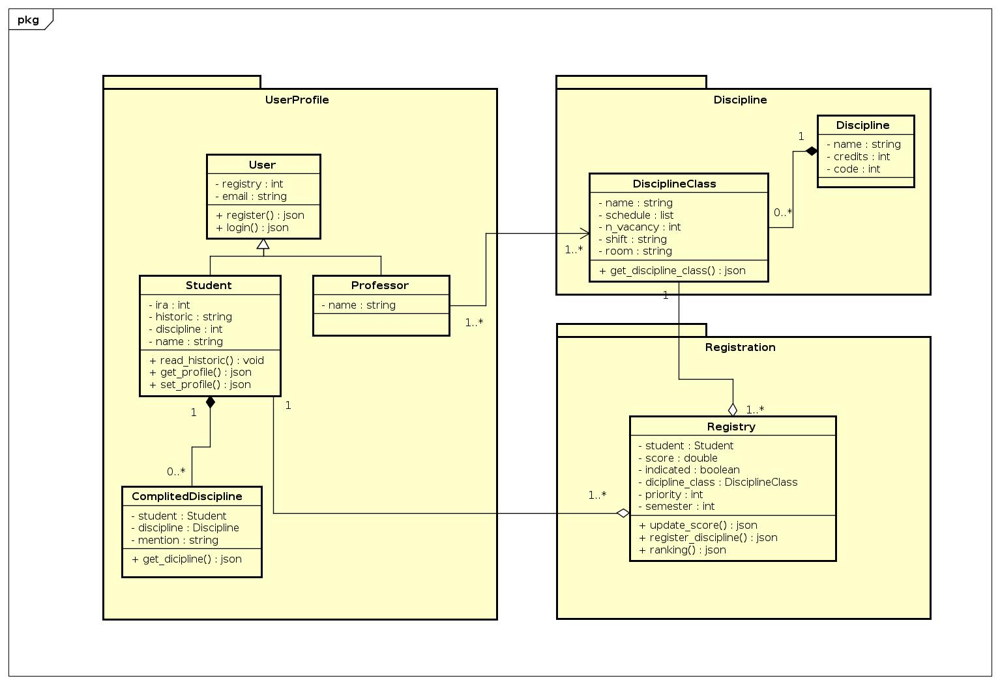

# DIAGRAMA DE CLASSES

## Histórico de revisão

| Data | Versão | Descrição | Autor(es)|
|:----:|:------:|:---------:|:--------:|
| 19/09/19 | 0.1 | Adição de introdução e referências | [Lieverton Silva](https://github.com/lievertom) e [Welison Regis](https://github.com/WelisonR) |
| 19/09/19 | 0.2 | Adição do diagrama de classe geral do backend | [Lieverton Silva](https://github.com/lievertom) e [Welison Regis](https://github.com/WelisonR) |

## Introdução

O diagrama de classes é um diagrama estático de estrutura UML que apresenta a organização do sistema projetado no nível de classes e interfaces, mostra seus recursos, restrições e relacionamentos - associações, generalizações, dependências, etc. Nesse diagrama, procura-se formular as classes, seus atributos (propriedades) e métodos.[^1]
Para o desenvolvimento dos diagramas de classes, utilizou-se a ferramenta [Astah UML](http://astah.net/editions/uml-new). O presente diagrama possui estrito relacionamento com outros diagramas, especialmente com o [diagrama de pacotes](diagrama_pacotes.md).

## Diagrama Geral - Backend

;

## Referências

[^1]: TO EDIT: https://www.uml-diagrams.org/class-diagrams-overview.html
[^2]: TO EDIT: aula de desenho.