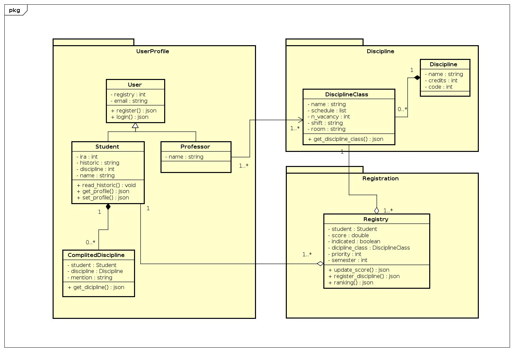
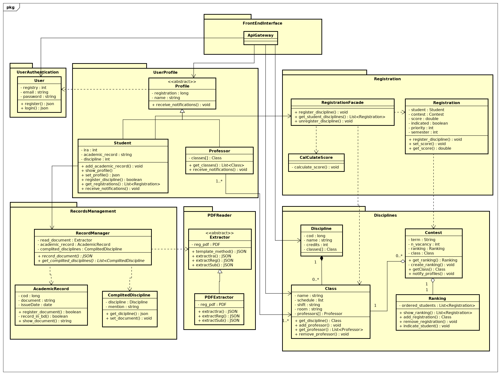
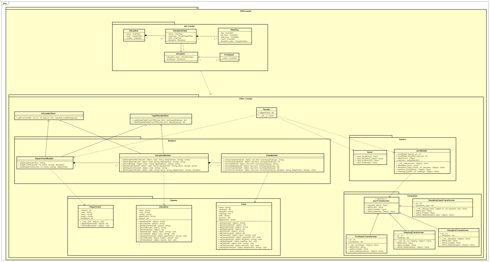

# DIAGRAMA DE CLASSES

## Histórico de revisão

| Data | Versão | Descrição | Autor(es)|
|:----:|:------:|:---------:|:--------:|
| 19/09/19 | 0.1 | Adição de introdução e ferramentas | [Lieverton Silva](https://github.com/lievertom) e [Welison Regis](https://github.com/WelisonR) |
| 19/09/19 | 0.2 | Adição do diagrama de classe geral do backend | [Lieverton Silva](https://github.com/lievertom), [Welison Regis](https://github.com/WelisonR) e [Lucas Maciel](https://github.com/Ridersk) |
| 19/09/19 | 0.3 | Adiciona referências | [Lieverton Silva](https://github.com/lievertom) e [Welison Regis](https://github.com/WelisonR) |
| 28/10/19 | 0.4 | Adição do diagrama de classe geral v2 | [Lucas Maciel](https://github.com/Ridersk)  |
| 17/11/19 | 1.0 | Adição diagrma de clsse crawler | [Lieverton Silva](https://github.com/lievertom) e [Welison Regis](https://github.com/WelisonR) |
| 17/11/19 | 1.1 | Adição diagrma de clsse crawler | [Andre Pinto](https://github.com/andrelucax) e  [Leonardo Medeiros](https://github.com/leomedeiros1) |

## Introdução

O diagrama de classes é um diagrama estático de estrutura UML que apresenta a organização do sistema projetado no nível de classes e interfaces, mostra seus recursos, restrições e relacionamentos - associações, generalizações, dependências, etc[^1]. Nesse diagrama, procura-se formular as classes, seus atributos (propriedades) e métodos.

Para o desenvolvimento dos diagramas de classes, utilizou-se a ferramenta [Astah UML](http://astah.net/editions/uml-new). O presente diagrama possui estrito relacionamento com outros diagramas, especialmente com o [Diagrama de Pacotes](diagrama_pacotes.md).

## Diagrama Geral - Backend

### Versão 1.0

;

### Versão 2.0

;

### Versão 3.0

;

## Diagrama MW Crawler

;

## Referências

[^1]: DIAGRAMS, UML. . In: UML Class and Object Diagrams Overview. [S. l.]: [s. n.], 19 set. 2019. Disponível em: <https://www.uml-diagrams.org/class-diagrams-overview.html> Acesso em: 19 set. 2019.
[^2]: SERRANO, Milene. Desenho - Aula 08 e 09. 2º/2019. Material apresentado para a disciplina de Desenho e Arquitetura de Software no curso de Engenharia de Software da UnB, FGA.
