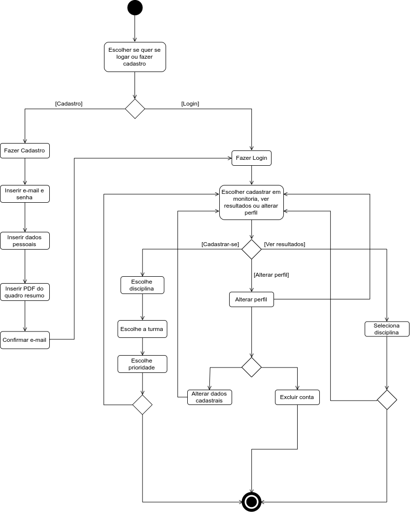
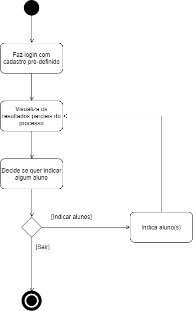

# DIAGRAMA DE ATIVIDADES

## Histórico de Revisão
| Data | Versão | Descrição | Autor(es) |
| :--: | :----: | :-------: | :-------: |
| 16/09/19 | 0.1 | Criação do estrutura inicial do documento | [Andre Pinto](https://github.com/andrelucax) e  [Leonardo Medeiros](https://github.com/leomedeiros1) |
| 16/09/19 | 0.2 | Adição da introdução | [Andre Pinto](https://github.com/andrelucax) e  [Leonardo Medeiros](https://github.com/leomedeiros1) |
| 16/09/19 | 0.3 | Adição do diagrama do Aluno v1.0 | [Andre Pinto](https://github.com/andrelucax) e  [Leonardo Medeiros](https://github.com/leomedeiros1) |
| 16/09/19 | 1.0 | Adição do diagrama do Professor v1.0 | [Andre Pinto](https://github.com/andrelucax) e  [Leonardo Medeiros](https://github.com/leomedeiros1) |

## Introdução
O diagrama de atividades é um diagrama UML utilizado para modelar o aspecto comportamental de processos. Neste diagrama, uma atividade é modelada como uma sequência estruturada de ações, controladas potencialmente por nós quanto a decisão e sincronismo. O foco, portanto, está nos procedimentos, processos de negócio e fluxo de trabalho.

## Diagrama de Atividades do Aluno V1.0

## Diagrama de Atividades do Professor V1.0

