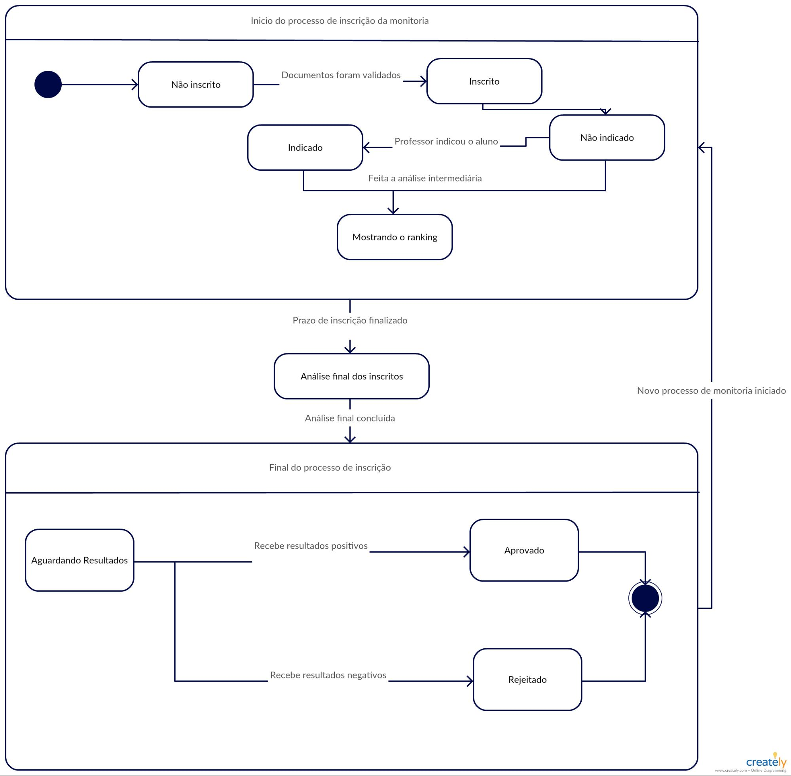
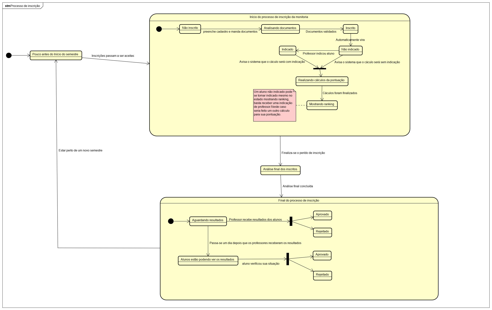
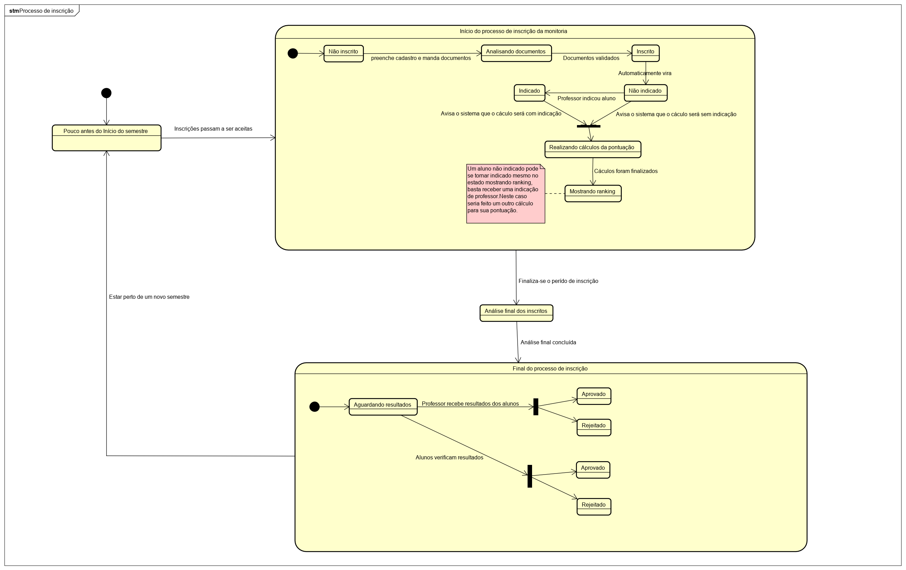
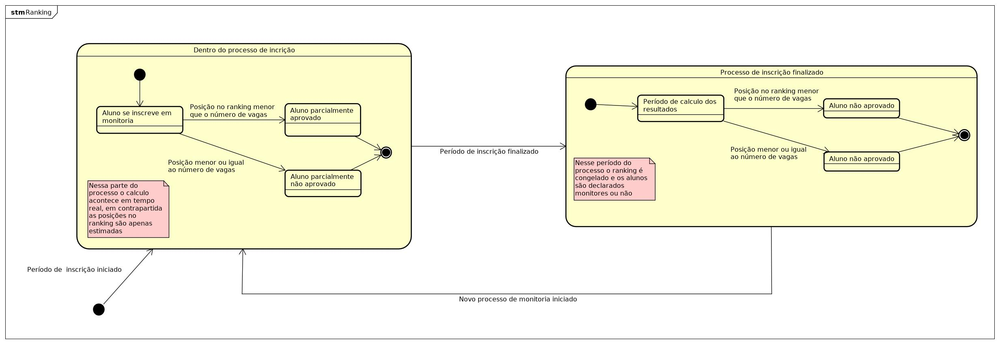

# DIAGRAMA DE ESTADOS

## Histórico de Revisão
| Data | Versão | Descrição | Autor(es) |
| :--: | :----: | :-------: | :-------: |
| 16/09/19 | 0.1 | Criação do estrutura inicial do documento | [Ivan Dobbin]((https://github.com/darmsDD)) e [Gustavo Lima](https://github.com/gustavolima00) |
| 16/09/19 | 0.2 | Adição do diagrama do processo de inscrição para aluno| [Ivan Dobbin]((https://github.com/darmsDD)) e [Gustavo Lima](https://github.com/gustavolima00) |
| 16/09/19 | 0.3 | Adição da Introdução | [Ivan Dobbin]((https://github.com/darmsDD)) |
| 19/09/19 | 0.4 | Adição da versão 2.0 do diagrama do processo de inscrição para aluno | [Ivan Dobbin]((https://github.com/darmsDD)) |
| 19/09/19 | 0.5 | Adição do diagrama de ranking | [Gustavo Lima](https://github.com/gustavolima00) |
|17/11/19| 0.6| Adição das referências|[Ivan Dobbin]((https://github.com/darmsDD))|
|17/11/19| 0.7| Adição da versão 3 do diagrama de inscrição do aluno|[Ivan Dobbin]((https://github.com/darmsDD)) e [Andre Pinto](https://github.com/andrelucax) e [Leonardo Medeiros](https://github.com/leomedeiros1)|

## Introdução
Esse diagrama tenta representar os vários estados por qual um objeto pode passar durante um processo.
## Diagramas

### Diagrama do processo de inscrição para aluno

### Versão 1.0

### Versão 2.0

### Versão 3.0

### Diagrama de ranking

## Referências

**[1]** SERRANO, Milene. **Arquitetura e Desenho de Software - Aula 10 (Aula Modelagem UML Dinâmica). 2º/2019**. Material apresentado para a disciplina de Arquitetura e Desenho de Software no curso de Engenharia de Software da UnB, FGA.