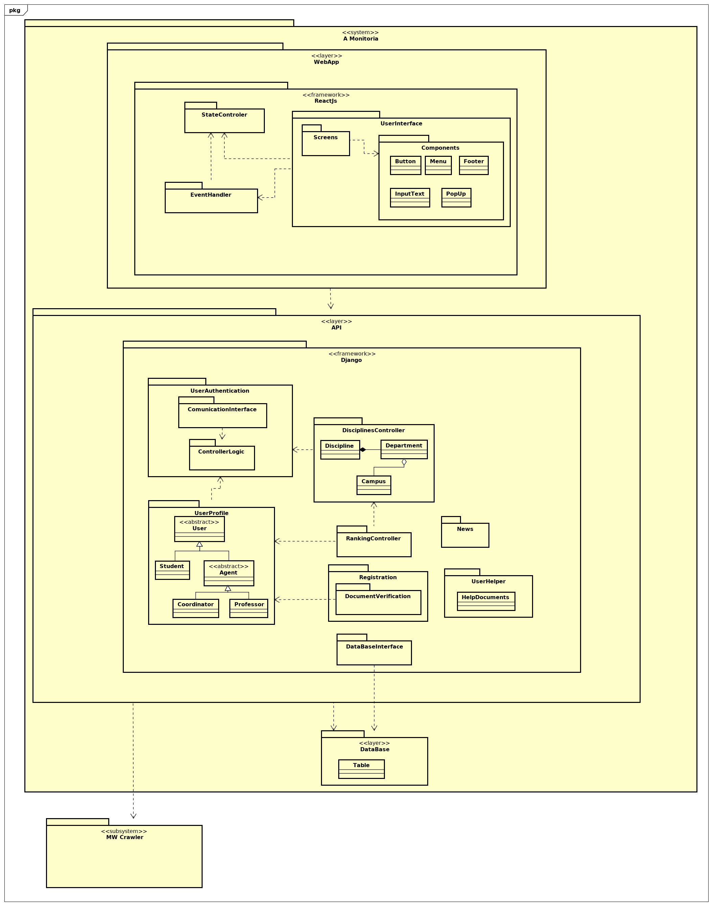

# DIAGRAMA DE PACOTES

## Histórico de revisão

| Data | Versão | Descrição | Autor(es)|
|:----:|:------:|:---------:|:--------:|
| 16/09/19 | 0.1 | Adição do diagrama geral | [Lucas Maciel](https://github.com/Ridersk) |
| 17/09/19 | 0.2 | Atualização diagrama geral 1.1 | [Lucas Maciel](https://github.com/Ridersk) |
| 17/09/19 | 0.3 | Atualização diagrama geral 1.2 | [Lucas Maciel](https://github.com/Ridersk) |
| 17/09/19 | 0.4 | Adição da Introdução e Referências | [Lucas Maciel](https://github.com/Ridersk) |
| 21/09/19 | 1.0 | Atualização diagrama geral 2.0 | [Lucas Maciel](https://github.com/Ridersk) |

## Introdução

Um diagrama de pacotes é definido pela UML, ele descreve os pacotes ou pedaços do sistema divididos em agrupamentos lógicos mostrando as dependências entre eles.
Um pacote é definido como: "Um mecanismo de propósito geral para
organizar elementos semanticamente relacionados em grupos". Um pacote possui vários modelos de elementos, que podem ser classes, objetos, estados, componentes ou até mesmo outros pacotes.

## Diagrama Geral

### Versão 1.0

### Versão 1.1

### Versão 1.2

### Versão 2.0

## Referências

[^1]: https://www.uml-diagrams.org/package-diagrams-overview.html
[^2]: https://pt.wikipedia.org/wiki/Diagrama_de_pacotes
[^3]: https://www.slideshare.net/Portal_do_estudante_ADS/diagramas-de-pacotes
