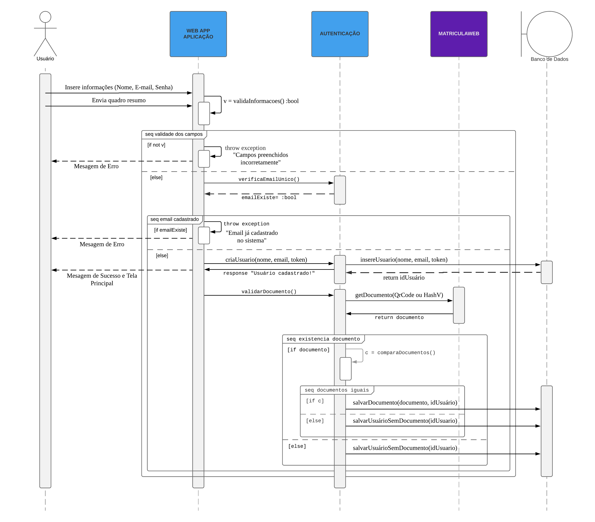
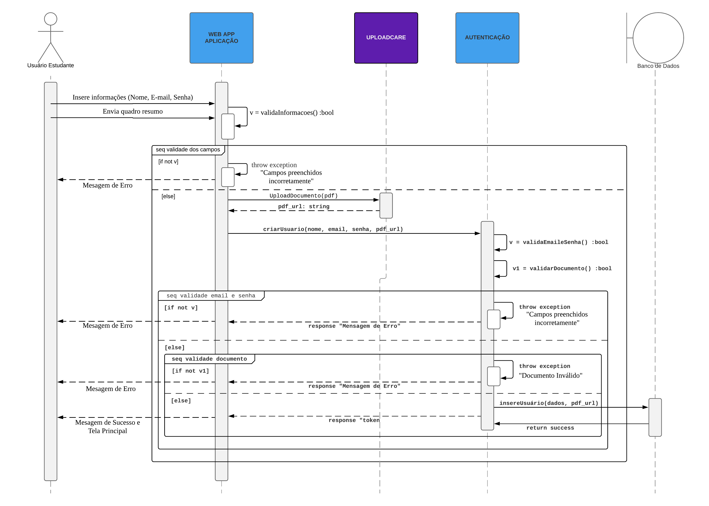
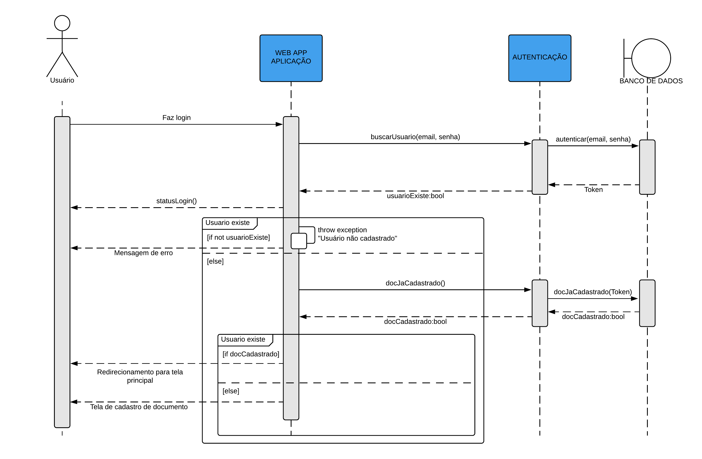
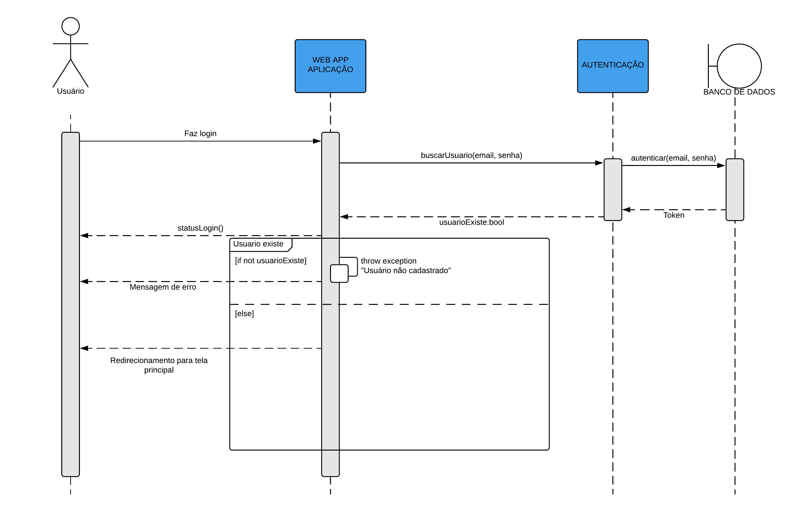

# Diagrama de Sequencia

## Histórico de revisão

|   Data   | Versão | Descrição | Autor(es)|
| :------: | :----: | :-------: | :------: |
| 16/08/19 |   0.1  | Adição do diagrama de sequência - login | [Paulo Vitor](https://github.com/PauloVitorRocha) |
| 19/08/19 |   0.2  | Adição da segunda versão do diagrama de sequẽncia - login | [Paulo Vitor](https://github.com/PauloVitorRocha), [João Rodrigues](https://github.com/rjoao) |
| 19/08/19 |   0.3  | Adição do diagrama de sequência - cadastro de usuário aluno | [João Rodrigues](https://github.com/rjoao) |
| 17/11/19 | 0.4 | Adição da segunda versão do diagrama de sequência - cadastro de usuário aluno | [João Rodrigues](https://github.com/rjoao) |
| 17/11/19 | 1.0 | Adição da terceira versão do diagrama de sequência - login de usuário | [Paulo Vitor](https://github.com/PauloVitorRocha), [João Rodrigues](https://github.com/rjoao) |

## Introdução

Esse documento tem por objetivo apresentar os diagramas de sequência da plataforma A Monitoria, ou seja, apresentar as interações entre seus objetos.

## Metodologia

Os diagramas de sequência são os diagramas dinâmicos mais relevantes na UML e na fase de projeto de software. Um diagrama de sequẽncia, exceto exceções, representa as interações entre os objetos que compõem uma plataforma.

## Diagrama de Sequência - Cadastro de Usuário Aluno

### Versão 1.0

### Versão 2.0

## Diagrama de Sequência - Login

### Versão 1.0

### Versão 2.0

### Versão 3.0

## Referências

**[1]** SERRANO, Milene. **Arquitetura e Desenho de Software - Aula 10 (Aula Modelagem UML Dinâmica). 2º/2019**. Material apresentado para a disciplina de Arquitetura e Desenho de Software no curso de Engenharia de Software da UnB, FGA.

