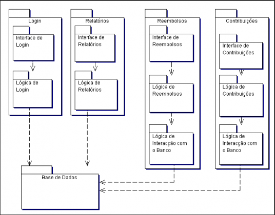
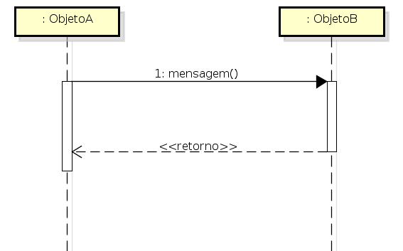

# METODOLOGIA

## Histórico de Revisão

| Data | Versão | Descrição | Autor(es)|
|:----:|:------:|:---------:|:--------:|
| 19/09/19 | 0.1 |  Criação do documento, indicação de tópicos e referências | [Joao Rossi](https://github.com/bielrossi15) |
| 19/09/19 | 0.2 |  Adição do diagrama de pacotes | [Joao Rossi](https://github.com/bielrossi15) |
| 19/09/19 | 0.3 |  Adição do diagrama de sequência | [Joao Rossi](https://github.com/bielrossi15) |

## Introdução

O presente documento busca definir e explicar para todos as diferenças básicas entre diagramas estáticos e dinâmicos da UML, além de definir os diagramas que o nosso time decidiu utilizar para diagramar nosso produto.

## Diagramas UML

### UML Geral
Os diagramas da **Unified Model Language** (UML) representam sistemas de software em diferentes níveis de detalhes. Existem diagramas que descrevem níveis mais altos do produto, como o **Diagrama de Estados**, tal qual existem diagramas que descrevem o software em um nível mais baixo, como o **Diagrama de Classes**.

### Diagramas UML Estáticos
Os diagramas estáticos da UML tem como foco a apresentação de características estruturais do sistema, enfatizando certas partes que o compõe. Por ser um tipo de diagrama com o foco estrutural, normalmente ele possui um nível mais baixo, mas não sendo necessariamente de baixo nível, definindo nome de classes, estruturas, assinaturas de métodos e pacotes.

**Exemplos**
- Diagrama de Classe;
- Diagrama de Casos de Uso;
  
### Diagramas UML Dinâmicos
Os diagramas dinâmicos da UML tem uma ênfase diferente, focando na parte comportamental do sistema, como ele vai agir em certas circunstâncias. Alguns chegam a ser de mais alto nível, mas podemos ver de todos os tipos. Parecido com o estático, ele nos mostra os objetos necessários para a construção do sistema e a comunicação entre eles por meio de métodos e suas mensagens.

**Exemplos**
- Diagrama de Sequência;
- Diagrama de Estado;
- Diagrama de Atividade;

## Diagramas Escolhidos pelo Grupo 

### [Diagrama de Classe](./diagrama_classes.md)
**Descrição**
É um diagrama fundamental para a modelagem de objetos e classes. O principal foco é descrever objetos, classes, pacotes, métodos e a comunicação, definindo a estrutura do projeto de software. O diagrama se torna uma captura instantânea que descreve o funcionamento exato do sistema, os relacionamentos entre os componentes e como é planejado a implementação dos mesmos.

**Uso do Grupo**

O grupo decidiu fazer um diagrama de classe com o objetivo citado acima, definir como o sistema funcionaria no nível mais baixo possível antes de realmente escrever as linhas de código.

**Visualização**

**Elementos Utilizados**
- Classes
- Objetos
- Pacotes
- Sinais
- Enumerações
- Artefatos
- Tipos de Dados

### [Diagrama de Estados](./diagrama_de_atividades.md)

**Descrição**

É um diagrama que fornece uma certa visualização comportamental do sistema, descrevendo a sequência de ação do processo. Semelhante a um fluxograma, mostram o fluxo de uma atividade, seja o principal, paralelo ou alternativo.

**Uso do Grupo**

O grupo utilizou o diagrama de atividades para principalmente descrever, de uma maneira mais simples e de fácil entendimento, como ocorreria o fluxograma geral de inscrição e acompanhamento em alguma monitoria.

**Visualização**

**Elementos Utilizados**
- Atividades
- Ações
- Nós de Controle
- Nós de Objeto
- Linhas de Atividade

### [Diagrama de Estados](./diagrama_de_estados.md)

**Descrição**

É um diagrama que representa a situação e estado de um objeto em pontos ao decorrer de uma execução de processos dentro do sistema, modelando os estados do objeto durante o seu ciclo de vida no software, sendo uma maneira eficiente de descrever os possíveis estados que ocorrem dentro do sistema e como ocorre a transição de um estado para o outro.

**Uso do Grupo**

O grupo utilizou o diagrama de estados de uma maneira mais específica do que ao utilizar o diagrama de atividades, utilizando-o para definir o processo de inscrição em uma matéria específica até o resultado final.

**Visualização**

### [Diagrama de Pacotes](./diagrama_pacotes.md)

**Descrição**

Diagrama de pacotes, ou diagrama de módulos, é um diagrama definido pela UML como um diagrama que divide o sistema em pacotes e pedaços em agrupamentos lógicos e mostrando as dependências que eles possuem entre sí.

**Uso do Grupo**

O grupo utilizou do diagrama para ter um diagrama estrutural mais macro do projeto, diferente do diagrama de classe, que é mais baixo nível, podemos utilizar o diagrama de pacote pra entender o funcionamento do sistema de um jeito diferente.

**Visualização**

### [Diagrama de Sequência](./diagrama_seq.md)

**Descrição**

O diagrama de sequência é um diagrama da UML que ilustra a sequência de mensagens entre objetos de uma certa interação. Mostra as mensagens transmitidas entre certos objetos, assim como as estruturas de controle entre os mesmos, por final, pode-se dizer que ele representa interações entre os objetos do sistema.

**Uso do Grupo**

O grupo utilizou o diagrama de sequência para definir, como dito previamente na descrição, como o sistema vai realizar a comunicação entre certos objetos dentro dele mesmo, para facilitar o entendimento da troca de mensagens e interações no nível de objeto.

**Visualização**

**Elementos Utilizados**
- Linhas de Vida
- Mensagens
- Interação

## Referências
[^1]: https://www.ibm.com/support/knowledgecenter/pt-br/SS5JSH_9.1.1/com.ibm.xtools.modeler.doc/topics/c_models_and_diagrams.html

[^2]: http://webcache.googleusercontent.com/search?q=cache:http://tassinfo.com.br/orientacao-a-objeto/11-modelos-uml-estaticos-vs-dinamicos/

[^3]: https://www.ibm.com/support/knowledgecenter/pt-br/SS8PJ7_9.6.0/com.ibm.xtools.modeler.doc/topics/cclassd.html

[^4]: https://www.ibm.com/support/knowledgecenter/pt-br/SS8PJ7_9.6.0/com.ibm.xtools.modeler.doc/topics/cactd.html

[^5]: http://micreiros.com/diagramas-comportamentais-da-uml-diagrama-de-estados/

[^6]: http://micreiros.com/diagrama-de-pacotes/

[^7]: https://www.ibm.com/support/knowledgecenter/pt-br/SSCLKU_7.5.5/com.ibm.xtools.sequence.doc/topics/cseqd_v.html