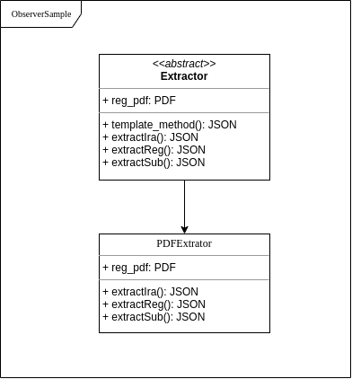

# GRASP e GOFs

## Histórico de revisão

|   Data   | Versão | Descrição | Autor(es)|
| :------: | :----: | :-------: | :------: |
| 23/10/2019 | 0.1 | Adiciona introdução sobre o módulo Backend | [Andre Pinto](https://github.com/andrelucax) e  [Leonardo Medeiros](https://github.com/leomedeiros1) |
| 24/10/2019 | 0.2 | Adiciona introdução sobre o PDF reader e template-method | [Paulo Vitor](https://github.com/paulovitorrocha) e  [João Gabriel Rossi](https://github.com/bielrossi15) |
| 23/10/2019 | 0.3 | Adicionado diagrama de classe para o Tempalte Method | [Andre Pinto](https://github.com/andrelucax) e  [Leonardo Medeiros](https://github.com/leomedeiros1) |

## Template-method

O Template Method é um padrão de design comportamental que define o esqueleto de um algoritmo na superclasse, mas permite que as subclasses substituam etapas específicas do algoritmo sem alterar sua estrutura. O Template Method foi utilizado no projeto nas funções de extração de informação do PDF de forma a manter a estrutura definida na superclasse intacta.

### PDF-Reader

O **PDF-Reader** do projeto é uma feature do módulo da aplicação [A Monitoria](https://github.com/2019-2-arquitetura-desenho/wiki/) responsável por extrair e salvar no banco de dados as informações referentes ao processo de monitoria como **Índice de Rendimento Acadêmico**, **Matrícula** e **Matérias passíveis de monitoria**, presentes no PDF do histórico escolar. Esse módulo é de suma importância para o projeto, pois, possibilitará apresentar as matérias que o aluno poderá realizar monitoria, assim como permitirá que seja disponibilizado um ranking em tempo real a partir da fórmula da monitoria.
No repositório da [Monitoria API](https://github.com/2019-2-arquitetura-desenho/monitoria-api/tree/feature/pdf-reader) aplicou-se alguns padrões de projeto pertinentes ao contexto, sendo eles empregados nas seguintes funções do PDF-Reader:

*   **ExtractIra**: função que extrai o Índice de Rendimento Acadêmico do PDF.

*   **ExtractReg**: função que extrai o número de matrícula do PDF.

*   **ExtractSub**: função que extrai as matérias passíveis de monitoria do PDF.

### Problema

Caso opte-se por implementar outro metodo de leitura de arquivo para extração dos dados, seria necessária uma grande reformulação no código. Com o tempalte method basta declarar uma classe que implementa a interface declarada.

### Solução Implementada

Decidiu-se por utilizar o template method visto que a extração das informações deveria seguir um "roteiro" para salvar os dados em json compatível com o banco de dados.

## Padrões usados por padrão no Django

### Active Record

Modelos devem encapsular cada aspecto de um objeto, seguindo o padrão de projeto Active Record de Martin Fowler.

Esse é o porque de ambos os dados representandos por um modelo e a informação sobre eles (seus nomes legíveis, opções como ordenação padrão, etc) são definidos na classe de modelo; toda a informação necessária para entender um dado modelo deveria ser amazenada no modelo.

### Padrões comportamentais

| GoF | Componente Django | Noção |
| :--: | :--: | :--: |
| Command | Http Request | Encapsula uma solicitação em um objeto |
| Observer | Signals | Quando um objeto muda de estado, todos os demais são associados a ele são notificados e atualizados automaticamente |
| Template Method | Visualizacao baseada em classes | Etapas de um algoritmo podem ser redefinidas por subclasses sem alterar a estrutura do algoritmo |

### Padrão estrutural

O serializer é uma importante estrutura do Django, que permite a  conversão de dados complexos como querysets e instâncias de modelo, em objetos python nativos, que podem ser facilmente transformados em outros tipos como JSON.
