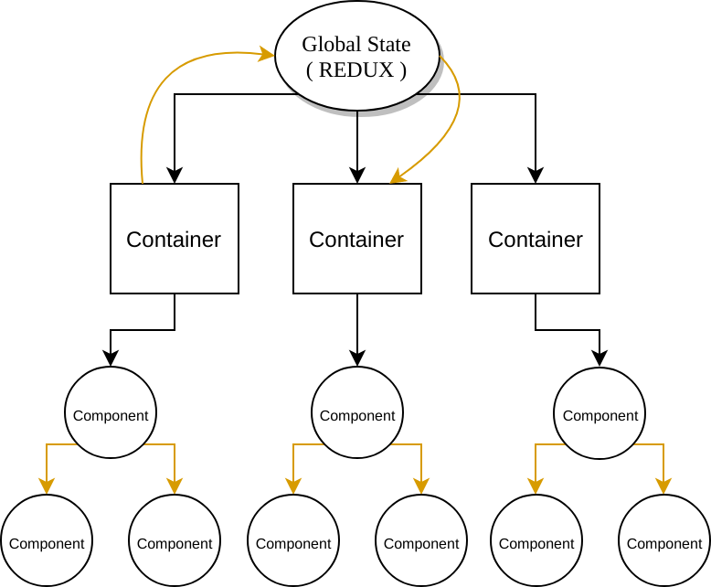
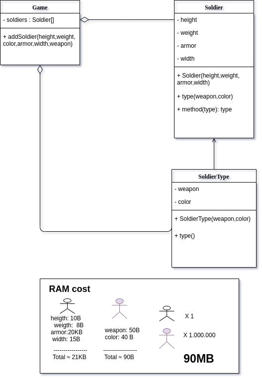

# Padrões e GOFs Adaptados do Front-end

## Histórico de revisão

| Data | Versão | Descrição | Autor(es) |
| :--: | :----: | :-------: | :-------: |
| 24/10/2019 | 0.1 | Adiciona Prop Drilling Pattern | [João Rodrigues](https://github.com/rjoao) |
| 24/10/2019 | 0.2 | Adiciona HOC | [Lucas Aguiar](https://github.com/Ridersk) |
|25/10/2019|0.3|Adiciona Flyweight|[Ivan Dobbin](https://github.com/darmsDD)|
|25/10/2019|0.3|Adiciona introdução|[Ivan Dobbin](https://github.com/darmsDD)|
|25/10/2019|0.3|Adiciona divisão entre padrões utilizados e não utilizados|[Ivan Dobbin](https://github.com/darmsDD)|

## Introdução
Este documento apresenta os padrões de design que serão utilizados no front-end
e alguns que não foram utilizados e o porque.  

## Padrões Utilizados

## 1. Prop Drilling Pattern

O padrão Prop Drilling é um padrão de gerenciamento de estado habitualmente utilizado no desenvolvimento de projetos ReactJS que empregam o Redux.

Esse padrão utiliza três tipos de estados e dois tipos de componentes.

### 1.1 Tipos de Estado

#### 1.1.1 Estado Global

Estado mantido fora da àrvore de componentes. Esse estado é proporcionado pelo Redux e é acessível a partir de qualquer lugar da aplicação.

#### 1.1.2 Estado do Componente

Estado mantido em um componente. Esse estado é comumente manipulado utilizando o:

```
this.setState()
```

#### 1.1.3 Estado Relativo

Estado que é passado de pai para filho na àrvore de componentes da aplicação.  

### 1.2 Componentes

#### 1.2.1 Container ou Stateful Component

Os componentes container são chamados de "componentes inteligentes".

Esses componentes possuem mais responsabilidade do que os componentes do tipo component e, nesse padrão, são os únicos responsáveis pelo consumo dos estados globais e pela criação de estados (estado global e estado do componente).

```
  class Register extends Component {
    constructor() {
      super();
      ...

      this.state = {
        ...
      }
    }

  }
```

#### 1.2.2 Component ou Stateless Component

Os componentes component são chamados de "componentes mudos". Esses componentes são responsáveis por apresentação e estilo e, nesse padrão, não criam seu próprio estado e nem o consomem de outros lugares, portanto não precisam ter toda a arquitetura de uma classe, com gerenciamento de estados, construtor, hierarquia etc...

Stateless Components é uma forma de implementar os "componentes burros". Normalmente é uma função pura. No exemplo do stateful abaixo, o Button seria um componente stateless.

```
  const Button = (props) => {
      const value = props.value ? props.value : ''
      const actionButton = props.onClick ? props.onClick : ''
      return (
          <button className="buttonStyle" onClick={actionButton}>
              {value}
          </button>
      );
  }
```

### 1.3 Diagrama



### 1.4 Exemplo em Código

```
/* App.js */
...
  handleChange(event) {
    /* Atualizando estado do componente */
    this.setState({ [event.target.id]: event.target.value });
  }

  render() {
    const { title } = this.state;

    return (
      <div>
        /* Consumir estados globais */
        <h1>Counter {this.props.counter}</h1>

        /* Alteração do estado global */
        <button onClick={() => this.props.increment()}>+</button>
        <button onClick={() => this.props.decrement()}>-</button>
        
        <label htmlFor="title">Title</label>
        <input
          type="text"
          id="title"
          value={title}
          onChange={this.handleChange}
        />
        /* Passando estado para o filho */
        <Child dataFromParent={this.state.title}></Child>
      </div>
    );
  }
}
...
```

```
/* child.js */
...
    render() {    
            return (
                <div>
                    /* Recebendo estado do pai */
                    Title: {this.props.dataFromParent}
                </div>
            );
        }
    }
...
```

[Código Completo](https://github.com/rjoao/example_propdrilling_pattern)

### Conclusões

A aplicação desse padrão proporciona a alteração de comportamento de acordo com o(s) estados. Essa característica o assemelha com os GOFs compornamentais, principalmente o State.

Seu ponto forte são as responsabilidades bem definidas e seu ponto fraco os problemas de gerência que podem surgir no transporte dos tipos de estados relativos pelos descendentes em projetos com muitos descendentes consecutivos.

## 2. High Order Components

High Order Component é uma função que pega um componente existente e retorna um outro componente, envolvendo-o (wrapper) atribuindo-lhe novas funcionalidades. Ele se originou das Higher-Order Functions. Um HOC é uma técnica avançada no React para reutilizar a lógica do componente, seguindo o mesmo principio do padrão Decorator. Os HOCs não fazem parte da API do React, por si só. Eles são um padrão que emerge da natureza composicional de React.

Um HOC não modifica o componente de entrada, nem usa herança para copiar seu comportamento. Em vez disso, um HOC compõe o componente original envolvendo-o em um componente de contêiner. Um HOC é uma função pura com zero efeitos colaterais.

### 2.1 Exemplo - Uso de PopUps

Utilizando a lógica dos HOCs é possivel reutilizar a lógica para abrir ou fechar um popup.

Criação da HOC

createPopup.js:
```

import React from 'react';

const createPopup = Popup => class extends React.Component{
   constructor(props){
      super(props);
   }

   closePopupHandler = () => {
      // lógica para fechar o popup
   }

   render(){
      return <Popup closePopup={this.closePopupHandler} {...this.props} />;
   }
}

export default createPopup;
```

PopUp que ganhará a funcionalidade

SignInPopup:
```
import React from 'react';

import createPopup from 'createPopup.js';

const SignInPopup = ({ closePopup, ...props }) => {
   return (
      <div class="popup">
         <button onClick={closePopup}>Fechar Popup</button>
         // Resto do JSX
      </div>
   )
}

export default createPopup(SignInPopup);
```

### 2.2 Aplicação do HOC com o Redux

Em nosso projeto, o exemplo mais claro do uso de HOC, vai ser através do uso da biblioteca de Redux para controlar os estados da aplicação.

O Redux é uma ferramenta de gerenciamento de estados bastante útil ou até mesmo uma necessidade nos aplicativos React à medida que seu estado aumenta de complexidade. O Redux permite gerenciar todo o estado do aplicativo em um objeto, a partir da Store(conjunto de estados da sua aplicação).


store simples:
```
import { Provider } from 'react-redux';
import { createStore } from 'redux';
import rootReducer from './reducers';

let initialStore = {
};

const store = createStore(rootReducer, initialStore);

ReactDOM.render(
  <Provider store={store}>
    <App />
  </Provider>, 
document.getElementById('root'));
```

component:
```
import { connect } from 'react-redux';

//Presentational component
class MyComponent extends Component {
   
	render() {
		//...
	}
}
  
//state to props 
const mapStateToProps = (state, ownProps) => {
return({
		itemState: state.someValue,
	});
};

//dispatch actions to props
const mapDispatchToProps = (dispatch, ownProps) => {
	return({
		handleAction: arg => dispatch(setMyAction(arg)),
	});
};

//Container component
export const MyComponentContainer = connect(
	mapStateToProps,
	mapDispatchToProps
)(MyComponent);

export default MyComponentContainer
```

## Padrões não utilizados

## 1. Flyweight
É um padrão de projeto que tem como objetivo economizar memória. A ideia 
principal é compartilhar as partes em comum dos objetos em vez de manter 
todos os dados de cada objeto nele mesmo. Isso permite que caibam mais objetos
dentro da RAM.

### 1.1 Problema
Vamos imaginar um jogo, no qual você tem um exército de soldados, cada soldado tem altura,largura,peso,cor,arma,armadura. O problema é que se cada soldado for um objeto, haverá um grande gasto de memória. Como resolver?

### 1.2 Solução
Você percebeu que os soldados sempre tem a mesma altura,peso,largura e armadura, mudando apenas a cor e a arma. A parte de dados constantes é chamada de estado intrínseco(altura,peso,largura,armadura) e a parte e estado extrínseco(cor,arma). A ideia é criar apenas um objeto com os estados intrísecos, e criar n objetos com os estados extrínsecos, que fazem referência aos estados intrísecos. Isso faz com que
haja menos repetição de dados, salvando muito memória.

### 1.3 Diagrama


### 1.4 Pseudocódigo
    Exemplo com árvores.

      //The flyweight class contains a portion of the state of a
      // tree. These fields store values that are unique for each
      // particular tree. For instance, you won't find here the tree
      // coordinates. But the texture and colors shared between many
      // trees are here. Since this data is usually BIG, you'd waste a
      // lot of memory by keeping it in each tree object. Instead, we
      // can extract texture, color and other repeating data into a
      // separate object which lots of individual tree objects can
      // reference.
      class TreeType is
          field name
          field color
          field texture
          constructor TreeType(name, color, texture) { ... }
          method draw(canvas, x, y) is
              // 1. Create a bitmap of a given type, color & texture.
              // 2. Draw the bitmap on the canvas at X and Y coords.

      // Flyweight factory decides whether to re-use existing
      // flyweight or to create a new object.
      class TreeFactory is
          static field treeTypes: collection of tree types
          static method getTreeType(name, color, texture) is
              type = treeTypes.find(name, color, texture)
              if (type == null)
                  type = new TreeType(name, color, texture)
                  treeTypes.add(type)
              return type

      // The contextual object contains the extrinsic part of the tree
      // state. An application can create billions of these since they
      // are pretty small: just two integer coordinates and one
      // reference field.
      class Tree is
          field x,y
          field type: TreeType
          constructor Tree(x, y, type) { ... }
          method draw(canvas) is
              type.draw(canvas, this.x, this.y)

      // The Tree and the Forest classes are the flyweight's clients.
      // You can merge them if you don't plan to develop the Tree
      // class any further.
      class Forest is
          field trees: collection of Trees

          method plantTree(x, y, name, color, texture) is
              type = TreeFactory.getTreeType(name, color, texture)
              tree = new Tree(x, y, type)
              trees.add(tree)

          method draw(canvas) is
              foreach (tree in trees) do
                  tree.draw(canvas)

### 1.5 Contras
Troca de RAM por ciclos de CPU quando alguma parte da data do contexto precisa
ser recalculada toda vez que alguém chama o método flyweight.

Fazer isso traz complexidade ao código. 

### 1.6 Problema para o contexto do projeto
Na parte front-end da aplicação não existe casos de repetição tão grandes(10^5)
que exista a necessidade de aplicar o flyweight. Existem partes que se repetem,
como por exemplo o container para cada matéria na hora de escolher a monitoria,
porém terá no máximo 10^2 repetições(aluno de 10º semestre de engenharia de software terá cursado aproximadamente 52 matérias), isto no pior dos casos. Assim como não há uma quantidade grande de repetições, não há necessidade de economizar memória que é a principal função desse padrão. Desta maneira utiliza-lo no front-end desta aplicação seria um overkill, e uma extensão desnescessário do padrão para o nosso caso específico.

## Referências

POWELL, Micah. **React State Management Patterns**. Disponível em: <https://itnext.io/react-state-management-patterns-908325dbb8f3> Acesso em: 24 de Outubro de 2019.

Maruta, Rafael. **10 obstáculos frequentes encontrados pelos novos tripulantes do React**. Disponível em: <https://medium.com/reactbrasil/10-obst%C3%A1culos-frequentes-encontrados-pelos-novos-tripulantes-do-react-7672c4facf58>

**Higher-Order Components no React**. Disponível em: <https://mathmesquita.me/2017/03/01/higher-order-components-no-react.html>

**Redux for React: A Simple Introduction**. Disponível em: <https://medium.com/@rossbulat/redux-for-react-a-simple-introduction-b1f9dcbda8f4>

**Flyweight**. Disponível em:<https://refactoring.guru/design-patterns/flyweight>