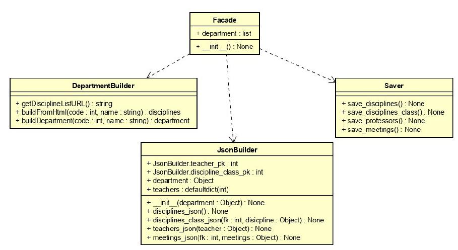
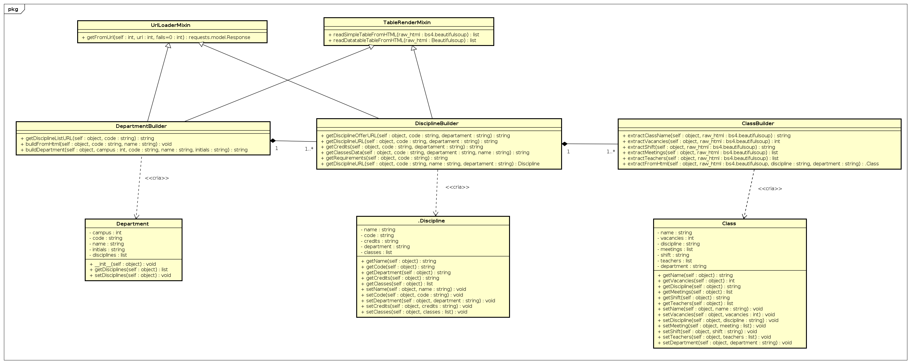
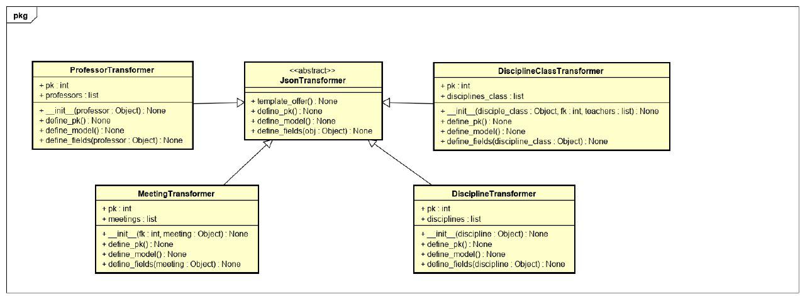

# Padrões e GOFs

## Histórico de revisão

|   Data   | Versão | Descrição | Autor(es)|
| :------: | :----: | :-------: | :------: |
| 23/10/2019 | 0.1 | Adiciona introdução sobre o módulo Web Crawler | [Lieverton Silva](https://github.com/lievertom) e [Welison Regis](https://github.com/WelisonR) |
| 23/10/2019 | 0.2 | Adiciona descrição e diagrama sobre template method usado | [Lieverton Silva](https://github.com/lievertom) e [Welison Regis](https://github.com/WelisonR) |
| 23/10/2019 | 0.3 | Adiciona descrição sobre padrão builder utilizado | [Lieverton Silva](https://github.com/lievertom) e [Welison Regis](https://github.com/WelisonR) |
| 24/10/2019 | 0.4 | Adiciona descrição e diagrama sobre padrão fachada utilizado | [Lieverton Silva](https://github.com/lievertom) e [Welison Regis](https://github.com/WelisonR) |
| 24/10/2019 | 1.0 | Atualiza referências e gera primeira versão do documento | [Lieverton Silva](https://github.com/lievertom) e [Welison Regis](https://github.com/WelisonR) |

## Introdução

O **Web Crawler** do projeto é um módulo da aplicação [A Monitoria](https://github.com/2019-2-arquitetura-desenho/wiki/) responsável por capturar e disponibilizar as **ofertas do campus da UnB-Gama** disponíveis no site do Matrícula Web, UnB. Esse módulo é de suma importância para o projeto, pois, possibilitará apresentar a oferta e uma descrição das informações pertinentes aos interesses do usuário para a matrícula em monitoria.
No repositório do [Crawler de Ofertas](https://github.com/2019-2-arquitetura-desenho/monitoria-crawler) aplicou-se alguns padrões de projeto pertinentes ao contexto, sendo eles empregados nos seguintes submódulos do Crawler:

*   **Builder**: baseado na oferta do Matrícula Web, captura dados sobre disciplinas, turmas, professores e informações corretas em relação ao campus Unb-Gama.
*   **Transformers**: trata a complexidade dos dados obtidos e manipula-os de maneira a modelar as adequação do banco de dados postgreSQL.
*   **Savers**: exporta os dados obtidos pelo Crawler para o formato json a fim de ser carregado no banco de dados.
*   **API**: fornece uma interface para obtenção das ofertas do campus UnB-Gama.

## Facade

Fachada é um padrão de design estrutural que fornece uma interface simplificada para uma biblioteca, uma estrutura ou qualquer outro conjunto complexo de classes.

### Problema

Decorrente das inúmeras tarefas realizadas pelo Web Crawler e pela API, gera-se certa complexidade na interface da aplicação. Portanto, é necessário a delegação de tarefas de modo a simplificar a interface.

### Solução Implementada

Estudou-se algumas soluções em relação a padrões para resolver o problema acima e, pode-se notar que o padrão fachada era o que apresentava uma solução de forma a não gerar demasiada quantidade de código ou estruturas complexas. Além disso, sua estrutura possibilitou **simplificar o sistema em subsistemas, o que o tornou mais reutilizável e simples de se customizar**.

**Modelagem do Facade**:


Portanto, implementou-se uma fachada que possui delega as responsabilidade para três módulos, conforme abaixo.

```python
from offer_crawler.builders.DepartmentBuilder import DepartmentBuilder
from offer_crawler.savers.JsonBuilder import JsonBuilder
from offer_crawler.savers.Saver import Saver


class Facade:
    def __init__(self):
        self.department = DepartmentBuilder().buildDepartment()
        JsonBuilder(self.department)
        Saver()


if __name__ == '__main__':
    Facade()

```

## Builder

O Builder é um padrão de design criacional que permite construir objetos complexos passo a passo.

### Problema

Devido a complexidade da criação do objeto é necessária a divisão do objeto em partes.

### Solução Implementada

O código desenvolvido foi baseado na aplicação MWScanner, disponível abertamente no GitHub. Adaptou-se o código e desenvolveu-se as necessidades do nosso projeto tendo como base o projeto citado.

**Modelagem do Builder**:


Abaixo, segue um exemplo de implementação do builder:

```
from bs4 import BeautifulSoup

from offer_crawler import BASE_URL
from offer_crawler.Mixins import TableReaderMixin, UrlLoaderMixin
from offer_crawler.Department import Department
from offer_crawler.builders.DisciplinesBuilder import DisciplinesBuilder
from multiprocessing.dummy import Pool as ThreadPool


class DepartmentBuilder(TableReaderMixin, UrlLoaderMixin):

    def getDisciplineListURL(self, code):
        return BASE_URL + 'graduacao/oferta_dis.aspx?cod={}'.format(code)

    def buildFromHtml(self, code, name):

        response = self.getFromUrl(self.getDisciplineListURL(code))

        if response.status_code != 200:
            return

        raw_html = BeautifulSoup(response.content, 'html.parser')
        table_data = self.readDatatableTableFromHTML(raw_html)

        disciplines = []

        if table_data is not None:

            def createCourses(data):

                discipline = DisciplinesBuilder().buildDiscipline(
                    data['Código'], data['Denominação'], code)

                disciplines.append(
                    discipline
                )

                return discipline

            pool = ThreadPool(16)
            c = pool.map(createCourses, table_data)
            pool.close()
            pool.join()

        print('[Department {}] Finished'.format(name))
        return disciplines

    def buildDepartment(self, code=650, name= 'UNB - FACULDADE DO GAMA'):

        disciplines = self.buildFromHtml(code, name)

        department = Department()
        department.setDisciplines(disciplines)

        return department
```

## Template Method

O **Template Method** é um padrão de design comportamental que define o esqueleto de um algoritmo na superclasse, mas permite que as subclasses substituam etapas específicas do algoritmo sem alterar sua estrutura. O Template Method foi fundamental no projeto no submódulo **"Transformers"**, pois possibilitou que os dados capturados pelo Crawler sejam tratados de maneira padronizada de forma a facilitar o armazenamento das ofertas (json) em um formato compreensível pelo banco de dados.

### Problema

Conforme exposto abaixo em um exemplo de uma disciplina, percebe-se que o json segue uma **estrutura em que se deve definir a "model", a chave primária da tupla e seus respectivos campos que são personalizados**:

```json
[
    {
        "model": "offers.discipline",
        "pk": 1,
        "fields": {
            "name": "DINÂMICA DOS FLUÍDOS",
            "code": "203866",
            "department": 650,
            "credits": "004-001-000-006"
        }
    },
]
```

### Solução Implementada

Decidiu-se por utilizar o template method visto que a exportação das ofertas deveria seguir um "roteiro" para salvar os dados em json compatível com o banco de dados.

**Modelagem do template method**:


#### Transformer Abstrata

Inicialmente, define-se uma **classe abstrata** que será responsável por definir os processos de conversão dos objetos em json:

``` python
from abc import ABC, abstractmethod


class JsonTransformer(ABC):
    def template_offer(self, obj) -> None:
        self.define_model()
        self.define_pk()
        self.define_fields(obj)

    @abstractmethod
    def define_model(self) -> None:
        pass

    @abstractmethod
    def define_pk(self) -> None:
        pass

    @abstractmethod
    def define_fields(self, obj) -> None:
        pass
```

#### Transformer Concreta

Definida a classe abstrata, utilizou-se as seguintes **classes concretas para transformar os dados em json**: DisciplineTransformer, DisciplineClassTransformer, MeetingTransformer e ProfessorTransformer.

Abaixo, segue um exemplo de transforme concreta implementada:

```python
import collections
import json
from offer_crawler.transformers.transformer import JsonTransformer


class DisciplineClassTransformer(JsonTransformer):
    pk = 1
    disciplines_class = []

    def __init__(self, discipline_class, fk, teachers):
        self.map_discipline_class = collections.defaultdict(dict)
        self.fk = fk
        self.teachers = teachers
        self.discipline_class = discipline_class

    def define_model(self) -> None:
        self.map_discipline_class["model"] = "offers.disciplineclass"

    def define_pk(self) -> None:
        self.map_discipline_class["pk"] = DisciplineClassTransformer.pk
        DisciplineClassTransformer.pk += 1

    def define_fields(self, discipline_class) -> None:
        self.map_discipline_class["fields"]["name"] = self.discipline_class.getName()
        self.map_discipline_class["fields"]["vacancies"] = self.discipline_class.getVacancies()
        self.map_discipline_class["fields"]["shift"] = self.discipline_class.getShift()
        self.map_discipline_class["fields"]["discipline"] = self.fk
        self.map_discipline_class["fields"]["teachers"] = self.teachers

        DisciplineClassTransformer.disciplines_class.append(self.map_discipline_class)
```

## Referências

[^1]: SERRANO, Milene. **Desenho - Aulas 16, 17, 18 e 19. 2º/2019**. Material apresentado para a disciplina de Desenho e Arquitetura de Software no curso de Engenharia de Software da UnB, FGA.
[^2]: REFACTORING, GURU. **Behavioral Design Patterns: Behavioral design patterns are concerned with algorithms and the assignment of responsibilities between objects**. Russia. 2019. Disponível: <https://refactoring.guru/design-patterns/behavioral-patterns>. Acesso em: 20 out. 2019.
