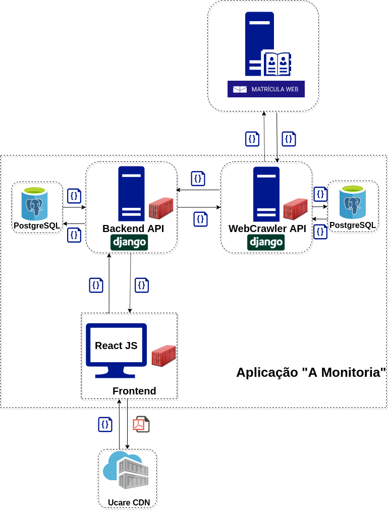
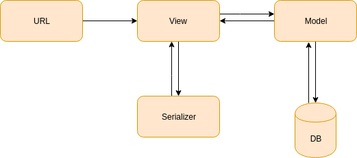
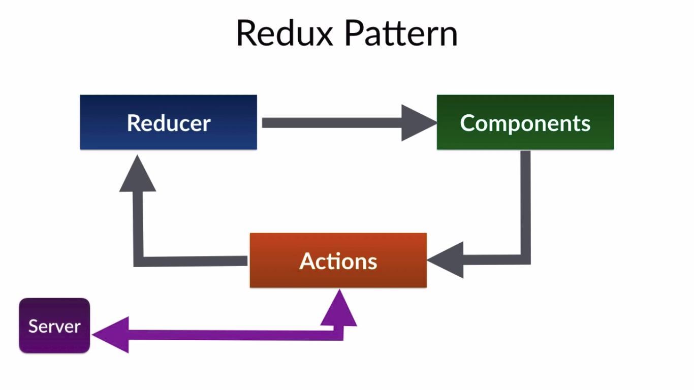
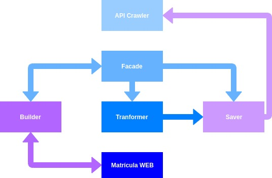
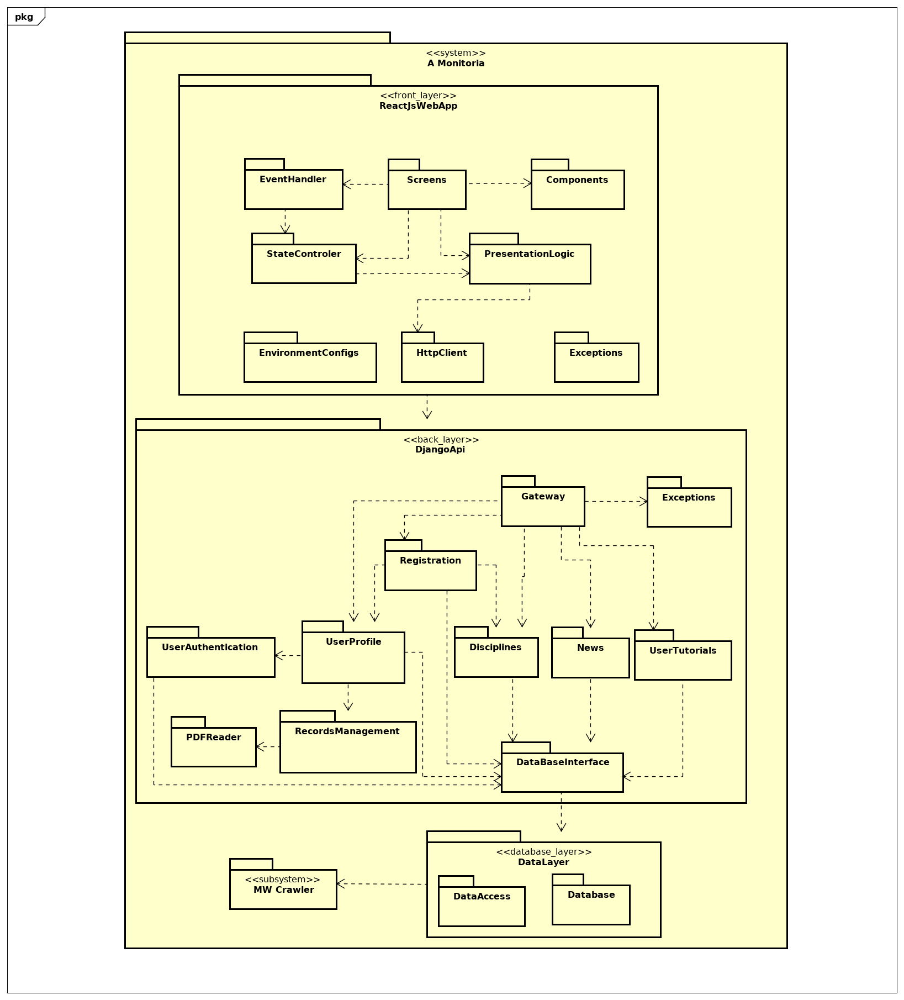
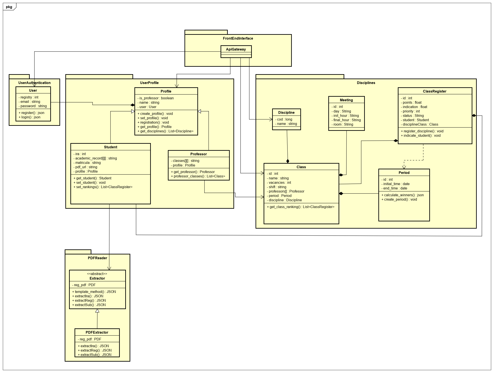
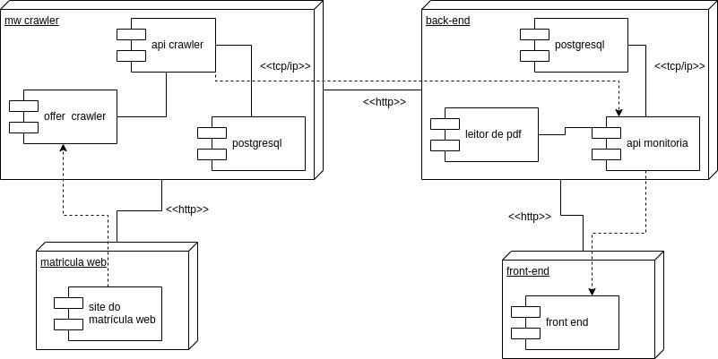

# Documento de Arquitetura de Software

## Histórico de Revisão

| Data | Versão | Descrição | Autor(es) |
|:--------:|:--------:|:----------------------:|:------------------:|
| 16/11/19 | 0.1 | Criação do Documento, separação de tópicos | [Welison Regis](https://github.com/WelisonR) |
| 16/11/19 | 0.2 | Adiciona representação arquitetural | [Welison Regis](https://github.com/WelisonR) |
| 17/11/19 | 0.3 | Inclui o objetivo, escopo e referências | [Paulo Vitor](https://github.com/PauloVitorRocha) |
| 17/11/19 | 0.4 | Adiciona restrições e metas arquiteturais | [Lieverton Silva](https://github.com/lievertom) e [Welison Regis](https://github.com/WelisonR) |
| 17/11/19 | 0.5 | Adiciona diagrama de componente | [Lieverton Silva](https://github.com/lievertom) e [Welison Regis](https://github.com/WelisonR) |
| 17/11/19 | 0.6 | Adiciona descrições de implementação e implantação do crawler | [Lieverton Silva](https://github.com/lievertom) e [Welison Regis](https://github.com/WelisonR) |
|17/11/19 | 0.7 | Adicionando Representação arquitetural do Front | [Ivan Dobbin](https://github.com/darmsDD) e [Andre Pinto](https://github.com/andrelucax) |
|17/11/19 | 0.8 | Adicionando Diagrama de Pacotes | [Ivan Dobbin](https://github.com/darmsDD) e [Andre Pinto](https://github.com/andrelucax) |
|17/11/19 | 0.9 | Adicionando Arquitetura Django | [Ivan Dobbin](https://github.com/darmsDD) e [Andre Pinto](https://github.com/andrelucax) |
| 17/11/19 | 0.10 | Adiciona diagrama arquitetural crawler api | [Lieverton Silva](https://github.com/lievertom) e [Welison Regis](https://github.com/WelisonR) |
|17/11/19 | 0.11 | Arrumando título do tópico 2.1 | [Ivan Dobbin](https://github.com/darmsDD) 
|17/11/19 | 0.12| Adição do diagrama de classes do Back-end API| [Ivan Dobbin](https://github.com/darmsDD) e [Andre Pinto](https://github.com/andrelucax) e  [Leonardo Medeiros](https://github.com/leomedeiros1)|

## 1. Introdução

### 1.1 Objetivo

Este documento fornece uma visão geral da arquitetura do sistema A Monitoria. Ele tem como objetivo capturar e demonstrar as decisões da equipe com relação ao escopo  arquitetural do projeto.

### 1.2 Escopo

Este Documento de Arquitetura de Software fornece uma visão geral de arquitetura do sistema A Monitoria. A Monitoria está sendo desenvolvido por alunos da UnB-FGA com o intuito de melhorar e facilitar o cadastro dos alunos em uma monitoria, de modo a deixar mais transparente e veloz o processo de seleção.

### 1.3 Definições, Acrônimos e Abreviações

* UnB: Universidade de Brasília
* FGA: Faculdade do Gama - Campus da Universidade de Brasília
* API: Application Programming Interface (Interface de Programação de Aplicativos)

### 1.4 Referências

As referências aplicáveis são:

* <https://sce.uhcl.edu/helm/RationalUnifiedProcess/webtmpl/templates/a_and_d/rup_sad.htm#1.%20%20%20%20%20%20%20%20%20%20%20%20%20%20%20%20%20%20Introduction>
 
* <https://github.com/2019-2-arquitetura-desenho/wiki>
* <https://www.cin.ufpe.br/~gta/rup-vc/core.informal_resources/guidances/examples/resources/ex_sad.htm>
* <https://www.cin.ufpe.br/~gta/rup-vc/extend.formal_resources/guidances/examples/resources/sadoc_v1.htm>

* <https://redux.js.org/basics/reducers>

* <https://android.jlelse.eu/react-native-redux-architecture-part-1-8178fc9065c2>

## 2. Representação Arquitetural

Numa visão macro da arquitetura, a aplicação "A Monitoria" é subsidiada por três principais módulos:

*   **API WebCrawler**: módulo da aplicação responsável por requisitar e disponibilizar as ofertas do campus da UnB-Gama disponíveis no site do Matrícula Web, UnB. As informações são disponibilizadas através de uma API elaborada em Django com banco de dados PostgreSQL e hospedada no serviço [Heroku](http://amonitoria-offers.herokuapp.com/discipline/).

*   **Front-end Web**: módulo da aplicação responsável por apresentar ao usuário informações de monitoria requisitadas nas APIs. O serviço foi desenvolvido em React, utiliza como CDN de PDF's o Upload Care e possui o deploy no serviço [Heroku](https://www.heroku.com/).

*   **API Back-end**: módulo da aplicação responsável por prover em conjunto a API WebCrawler recursos necessários ao processo de matrícula em monitoria demandados pelas regras de negócio. As informações são disponibilizadas através de uma API elaborada em Django com banco de dados PostgreSQL e hospedada no serviço [Heroku](https://www.heroku.com/).

### 2.1 Back-end API

### 2.2 Front-end

* **Components:** 

Componentes são os componentes JavaScript ou classes JavaScript que são responsáveis por renderizar a view.

* **Actions:** 

É uma coleção de funções que realização alguma requisição no servidor

* **Reducer:**

É ele que diz como os estados da aplicação mudam de acordo com as respostas da actions.

*  **Server:**

Local da onde vem os dados.

### 2.3 Crawler API

## 3. Restrições e Metas Arquiteturais

| Requisito | Solução |
|:---------:|:-------:|
| **Linguagem** | O front-end será elaborado em JavaScript e o back-end em Python. |
| **Plataforma** | Serão usadas as plataformas ReactJS para o front-end e Django para o back-end. |
| **Segurança** | É necessário resguardar que haja segurança tanto ao perfil de estudante quanto ao perfil de professor na aplicação, não possibilitando a criação de um perfil inválido. Além disso, os dados precisam interagir de uma forma anônima e, para isso, deve-se fazer a utilização de token nas requisições. |
| **Persistência** | Os dados deverão ser persistidos em banco de dados através do banco relacional PostgreSQL. A escolha por um banco relacional deriva de questões como escalabilidade, confiança (atomicididade, consistência, isolamento e durabilidade) e complexidade lógica da aplicação, além disso, leva-se em conta a facilidade de deploy contínuo em serviços de hospedagem web, diferente dos bancos não relacionais. |
| **Arquitetura** | Devido ao contexto do problema, isto é, aplicação com uma lógica bem definida e que não necessita escalar em alto nível (voltado ao público da FGa), será desenvolvida uma aplicação baseada em uma arquitetura monolítica definida em camadas, que centralizará as atividades e proverá maior desempenho ao serviço. |
| **Outros** | - Equipe com 09 membros;  - Utilização de serviços de deploy gratuitos (e limitados, claramente);   - Prazo de desenvolvimento da aplicação em aproximadamente 120 dias.  - A aplicação deve ser responsível a fim de ser utilizada tanto web como mobile.|

## 4. Visão Lógica

### 4.1 Diagrama de Pacotes Geral

### 4.2 Back-end API

#### 4.2.1 Diagrama de Classes do Back-end API

### 4.3 Webcrawler API

#### 4.3.1 Diagrama de Classes do Crawler

## 5. Visualização de implantação

O Diagrama de implementação serve para dar uma visão de como seria implementado em hardware a arquitetura proposta. Visto que nela é possível ver a quantidade de servidores e/ou serviços por servidores , máquinas pessoais e protocolos de comunicação.

Diagrama de implantação da aplicação "A Monitoria":

### 5.1 Servidores MW Crawler (Heroku)

O serviço de crawler das informações de oferta do matrícula web por meio de http está hospedado na plataforma [Heroku](https://www.heroku.com/), assim como sua API e demais serviços. O serviço está integrafo por meio de protocolo tcp/ip para fins de conexão.

### 5.2 Servidores back-end (Heroku)

O serviço de back-end disponibiliza uma interface para a manipulação dos dados relacionados ao processo de monitoria, como históricos escolares e dados pessoais do cadastrante. O serviço está disponível por meio de requisições http por meio da plataforma [Heroku](https://www.heroku.com/).

### 5.3 Servidores front-end (Heroku)

O serviço de front-end está sendo disponibilizado em interface web por meio de requests http disponibilizadas através da plataforma [Heroku](https://www.heroku.com/).

### 6. Visão de Implementação

#### 6.1 Camadas API WebCrawler

No repositório do Crawler de Ofertas aplicou-se alguns padrões de projeto pertinentes ao contexto, sendo eles empregados nos seguintes submódulos do Crawler:

*   **Builder**: baseado na oferta do Matrícula Web, captura dados sobre disciplinas, turmas, professores e informações correlatas ao campus UnB-Gama.
*   **Transformers**: trata a complexidade dos dados obtidos e manipula-os de maneira a modelar adequadamente os dados ao modelo de dados do banco postgreSQL.
*   **Savers**: exporta os dados obtidos pelo Crawler para o formato json a fim de ser carregado no banco de dados.
*   **API**: fornece uma interface para obtenção das ofertas do campus UnB-Gama.

## 7. Tamanho e Desempenho

A Monitoria é uma aplicação web, logo não há a necessidade de instalação da plataforma no host do usuário, cumprindo com os requiditos não funcionais, uma vez que a nececidade de instalação da aplicação, para uso em cuto período de tempo, causaria desconforto ao usuário. A aplicação não ocupa espaço físico para o usuário, o sistema é representado por três servidores rodando em nuvem, um reponsável pelo front-end, outro pelo back-end e, por fim, um terceiro que realiza comunicação com o matrícula web para extrair os dados sobre a oferta do semestre letivo. 

## 8. Qualidade

