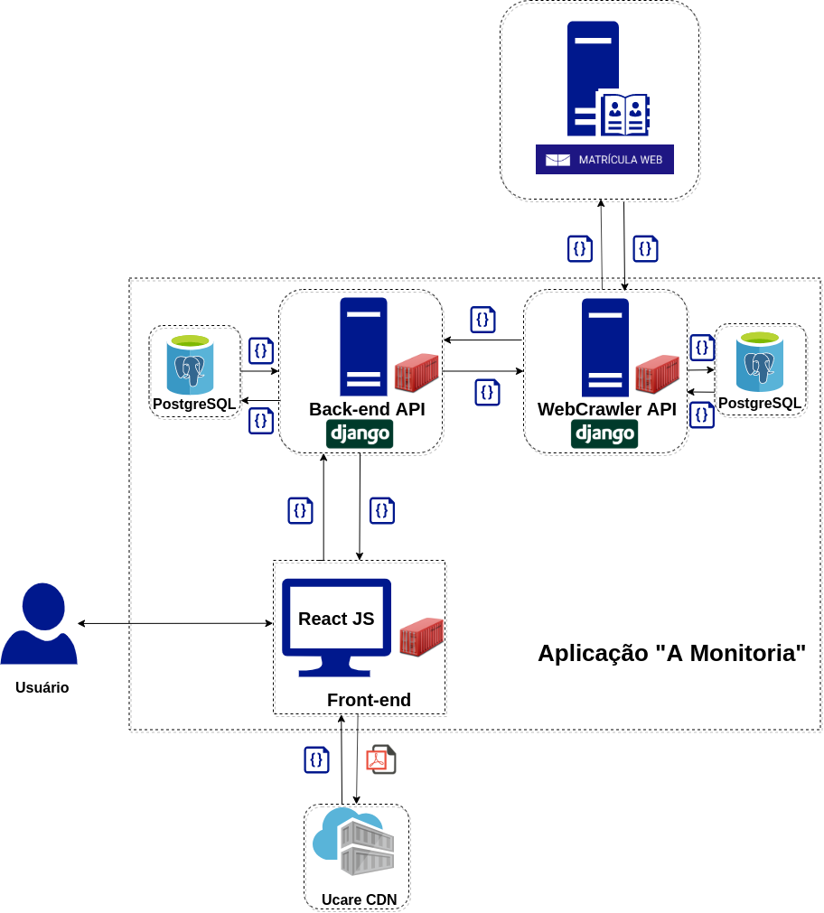

# Documento de Arquitetura de Software

## Histórico de Revisão

| Data | Versão | Descrição | Autor(es) |
|:--------:|:--------:|:----------------------:|:------------------:|
| 16/11/2019 | 0.1 | Criação do Documento, separação de tópicos | [Welison Regis](https://github.com/WelisonR) |
| 17/11/2019 | 0.2 | Adiciona representação arquitetural | [Welison Regis](https://github.com/WelisonR) |

## 1. Introdução

### 1.1 Objetivo

### 1.2 Escopo

### 1.3 Definições, Acrônimos e Abreviações

* UnB: Universidade de Brasília
* FGA: Faculdade do Gama - Campus da Universidade de Brasília
* API: Application Programming Interface (Interface de Programação de Aplicativos)

### 1.4 Referências

As referências aplicáveis são:

* <https://sce.uhcl.edu/helm/RationalUnifiedProcess/webtmpl/templates/a_and_d/rup_sad.htm#1.%20%20%20%20%20%20%20%20%20%20%20%20%20%20%20%20%20%20Introduction>
 
* <https://github.com/2019-2-arquitetura-desenho/wiki>

### 1.5 Visão Geral

<!-- Este documento visa detalhar as soluções arquiteturais desenvolvidas no sistema. Deste modo, neste documento serão abordados os seguintes aspectos:

* Representação Arquitetural
* Restrições e Metas Arquiteturais
* Visão de Casos de Uso
* Visão Lógica
* Visão de Processos
* Visualização da Implementação
* Visão de Dados
* Tamanho e Desempenho
* Qualidade -->

## 2. Representação Arquitetural

Numa visão macro da arquitetura, a aplicação "A Monitoria" é subsidiada por três principais módulos:

*   **API WebCrawler**: módulo da aplicação responsável por requisitar e disponibilizar as ofertas do campus da UnB-Gama disponíveis no site do Matrícula Web, UnB. As informações são disponibilizadas através de uma API elaborada em Django com banco de dados PostgreSQL e hospedada no serviço [Heroku](http://amonitoria-offers.herokuapp.com/discipline/).

*   **Frontend Web**: módulo da aplicação responsável por apresentar ao usuário informações de monitoria requisitadas nas APIs. O serviço foi desenvolvido em React, utiliza como CDN de PDF's o Upload Care e possui o deploy no serviço [Heroku](https://www.heroku.com/).

*   **API Backend**: módulo da aplicação responsável por prover em conjunto a API WebCrawler recursos necessários ao processo de matrícula em monitoria demandados pelas regras de negócio. As informações são disponibilizadas através de uma API elaborada em Django com banco de dados PostgreSQL e hospedada no serviço [Heroku](https://www.heroku.com/).

### 2.1 Crawller API

To do

### 2.2 Backend API

To do

### 2.3 Front-end

To do

## 3. Restrições e Metas Arquiteturais

## 4. Visão de Casos de Uso

## 5. Visão Lógica

### 5.1 Front-end

### 5.2 Crawller API

### 5.3 Backend API

## 6. Visualização da Implementação

## 7. Visão da Implementação

## 8. Visão de Dados

### 8.1 WebCrawler

### 8.2 Front-end

## 9. Tamanho e Desempenho

## 10. Qualidade
