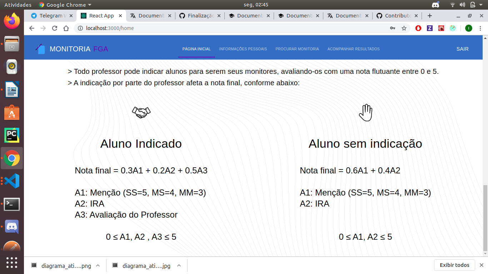
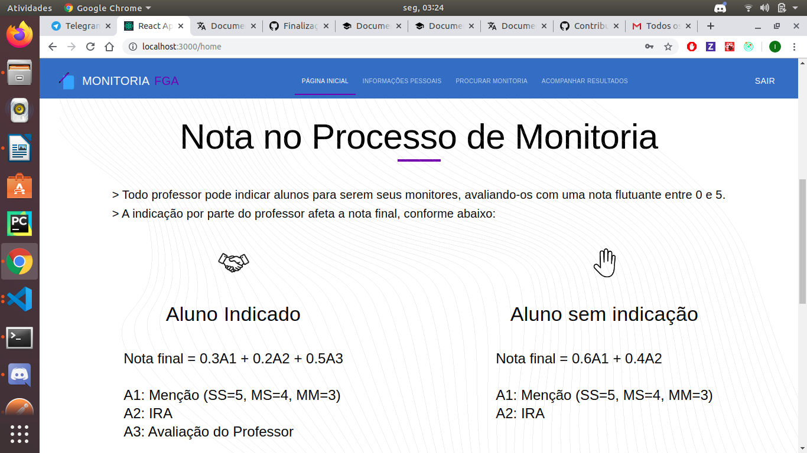
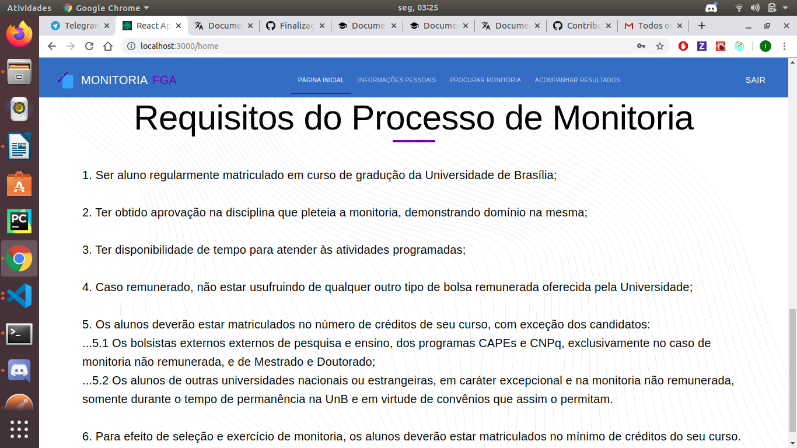

# Imagens do sistema

## Histórico de Revisão

| Data | Versão | Descrição | Autor(es) |
|:--------:|:--------:|:----------------------:|:------------------:|
| 18/11/19 | 0.1 | Adição das imagens do estudante| [Ivan Dobbin](https://github.com/darmsDD)
|18/11/19 | 0.2 | Adição da introdução| [Ivan Dobbin](https://github.com/darmsDD)
|18/11/19 | 0.3 | Adição das imagens do professor| [Ivan Dobbin](https://github.com/darmsDD) |

### Introdução

Este documento tem como objetivo mostrar a foto de todas as telas do sistema.

### Imagens aluno

### Imagens professor

