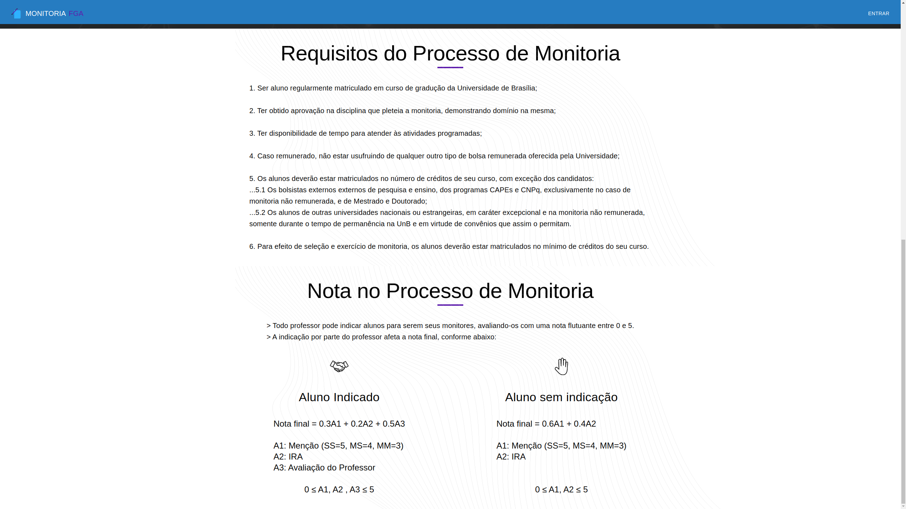

# Apresentação Final

## Histórico de Revisão:
| Data | Versão | Descrição | Autor |
|:---:|:---:|:---:|:---:|
| 17/11/19 | 0.1 | Adicionando introdução e discorrendo sobre Gerência e funcionalidades | [Paulo Vitor](https://github.com/PauloVitorRocha), [João Rossi](https://github.com/bielrossi15) |
| 17/11/19 | 0.2 | Adicionando a explicação do produto, desenvolvimento e trabalho em equipe | [Paulo Vitor](https://github.com/PauloVitorRocha), [João Rossi](https://github.com/bielrossi15) | 
| 17/11/19 | 0.3 | Adicionando imagens do produto | [Paulo Vitor](https://github.com/PauloVitorRocha), [João Rossi](https://github.com/bielrossi15) |
| 18/11/19 | 0.4 | Revisão e adição no documento, novas imagens | [Welison Regis](https://github.com/WelisonR) |

## 1. Introdução
Este documento refere-se a apresentação final do grupo "A Monitoria" da matéria Arquitetura e Desenho de Software.
Tem-se como objetivo **demonstrar os principais pontos do trabalho realizado pela equipe ao longo do semestre**, não só demonstrando o produto final mas também descrevendo um pouco sobre as metodologias utilizadas e artefatos decorrentes do ciclo de vida que envolve o desenvolvimento de software tendo como foco principalmente os artefatos típicos de Desenho de Software, como padrões de projeto utilizados, etc.

!!! info "Página com todos os artefatos"
    #### [Visualizar todos os artefatos](../dinamica_seminario_I/design_sprint.md)

## 2. O produto
A ideia do produto passou por uma seleção criteriosa, utilizando 3 métodos para a escolha, sendo eles:   

- [5W2H](../dinamica_seminario_I/definicao_tema/5W2H.md);
- [Rich Picture](../dinamica_seminario_I/definicao_tema/rich_picture.md);  
- [Ishikawa](../dinamica_seminario_I/definicao_tema/ishikawa.md).
   
Foram utilizados os documentos acima para levantar necessidades, fluxos de trabalho e possíveis problemas que seriam encontrados no decorrer do projeto, sendo a escolha final baseada numa votação entre os membros do grupo com opiniões baseadas nos levantamentos finais da documentação auxiliar.

Após decidido pelo tema "A Monitoria", foi criado também um [Documento de Visão](../extras/documento_visao.md) para ajudar o processo de entendimento do escopo do projeto, além de alguns artefatos para elicitação, como [Protótipo](../../dinamica_seminario_I/Elicitacao/prototipo/) e [Questionário](../../dinamica_seminario_I/Elicitacao/questionario/) para ajudar a visualização do levantamento do escopo assim como a opinião de futuros usuários sobre o escopo e algumas funcionalidades do projeto.

Para ajudar a equipe a entender como o produto funcionaria a um nível de mercado, a priori, foi criado um documento de [Benchmarking](https://2019-2-arquitetura-desenho.github.io/wiki/dinamica_seminario_I/benchmarking/) para a equipe definir os diferenciais do produto em relação aos concorrentes no mercado.  
Além da posição no mercado em que o produto se encontraria, foi escolhido levantar os possíveis custos e lucros do produto com um documento de [Estimativas de Custo](https://2019-2-arquitetura-desenho.github.io/wiki/dinamica_seminario_I/estimativas_de_custo/).

Por final, a equipe montou um documento de [Identidade Visual](https://2019-2-arquitetura-desenho.github.io/wiki/dinamica_seminario_II/identidade_visual/) para manter um padrão bem definido sobre o design do produto.

## 3. Trabalho em Equipe
Com o escopo começando a melhor se definir, a equipe começou a desenhar de maneira adequada as [Metodologias](../../dinamica_seminario_II/metodologias/) que serão aplicadas no desenvolvimento durante a disciplina.  A equipe utilizou três diferentes metodologias, o Scrum, o Extreme Programming e o Kanban, além de outros artefatos de suporte, todos aliados a tecnologias voltadas para a integração da equipe, conforme pode-se notar no diagrama abaixo:

**O projeto foi dividido em 4 repositórios:**

- [Wiki](https://github.com/2019-2-arquitetura-desenho/wiki) - Nesse repositório toda a documentação foi mantida;
- [Front-end](https://github.com/2019-2-arquitetura-desenho/monitoria-app) - Repositório dedicado apenas ao front-end do projeto, em React;
- [Back-end](https://github.com/2019-2-arquitetura-desenho/monitoria-api) - Repositório com o código da API;
- [Web Crawler](https://github.com/2019-2-arquitetura-desenho/monitoria-crawler) - Repositório do Web Crawler para salvar as matérias oferecidas na FGA;

## 4. Gerência
O presente tópico busca definir e formalizar as metodologias de trabalho que foram aplicadas no desenvolvimento do projeto. Nesse sentido, quanto as metodologias pertinentes ao escopo de elaboração da aplicação, podemos citar o scrum, kanban, extreme programming. Já para as metodologias de gerência temos, reuniões, quadro de conhecimento e avaliações de desempenho com burndown, velocity. Para um melhor detalhamento sobre metodologia visite a página de [Metodologias](https://2019-2-arquitetura-desenho.github.io/wiki/dinamica_seminario_II/metodologias/) em nossa [Wiki](https://2019-2-arquitetura-desenho.github.io/wiki/).

Fora as metodologias voltadas ao gerenciamento de equipe, o grupo preocupou-se em subsidiar artefatos de gerência ligadas a qualidade e padronização de condultas de codificação, como pode-se citar o [Plano de Gerenciamento de Configuração](../dinamica_seminario_II/gerenciamento_configuracao.md). Além disso, outros artefatos foram essenciais para a gerência do projeto, como, por exemplo, o andamento do projeto com o [Diagrama de Gantt](../dinamica_seminario_II/diagrama_gantt.md), entre outros elaborados na dinâmica II.

## 5. Funcionalidades
O escopo do projeto foi definido entre os membros do grupo em conjunto com a professora Milene Serrano. As funcionalidades foram definidas a partir de um [questionario](https://2019-2-arquitetura-desenho.github.io/wiki/dinamica_seminario_I/Elicitacao/questionario/) para alunos e professores da universidade. As funcionalidades foram também definidas por meio de um [protótipo](https://2019-2-arquitetura-desenho.github.io/wiki/dinamica_seminario_I/Elicitacao/prototipo/) o que facilitou a limitação de escopo do projeto.

## 6. Desenvolvimento
Entrando na competência do desenvolvimento, a equipe se ateve primeiro ao gerenciamento do projeto com documentos para o controle e definição da aplicação para depois criar diagramas UML do projeto, seguido das especificações dos padrões para a solução dos problemas que seriam encontrados durante o decorrer do projeto e por fim, um documento de arquitetura para falar da integração e funcionamento deste produto software em suas 3 frontes principais: Web Crawler, Front-end e Back-end.

### 6.1 Diagramas Estáticos e Dinâmicos

Foram feitos diagramas UML estáticos e dinâmicos, para ter a representação do produto em diferentes níveis de detalhes. 

#### 6.1.1 Diagramas Estáticos
- [Diagrama de Classes](https://2019-2-arquitetura-desenho.github.io/wiki/dinamica_seminario_III/diagrama_classes/);
- [Diagrama de Pacotes](https://2019-2-arquitetura-desenho.github.io/wiki/dinamica_seminario_III/diagrama_pacotes/).

#### 6.1.2 Diagramas Dinâmicos
- [Diagrama de Sequência](https://2019-2-arquitetura-desenho.github.io/wiki/dinamica_seminario_III/diagrama_seq/);  
- [Diagrama de Estado](https://2019-2-arquitetura-desenho.github.io/wiki/dinamica_seminario_III/diagrama_de_estados/);
- [Diagrama de Atividades](https://2019-2-arquitetura-desenho.github.io/wiki/dinamica_seminario_III/diagrama_de_atividades/).

### 6.2 Patterns

No que compete a padrões de projeto, a equipe selecionou alguns específicos para resolver os problemas do nosso produto. Foram utilizados diferentes padrões em nossos 3 repositórios e aqui tem-se o detalhamento de cada um:  

- [Patterns Web Crawler](https://2019-2-arquitetura-desenho.github.io/wiki/dinamica_seminario_IV/webcrawler_patterns/);  
- [Patterns Front-end](https://2019-2-arquitetura-desenho.github.io/wiki/dinamica_seminario_IV/front-end_patterns/);  
- [Patterns Back-end](https://2019-2-arquitetura-desenho.github.io/wiki/dinamica_seminario_IV/back-end_patterns/).

### 6.3 Documento de Arquitetura de Software

Após um escopo bem definido e com diversos artefatos que subsidiam escolhas arquiteturais ao projeto, começou-se a elaborar o [Documento de Arquitetura](https://2019-2-arquitetura-desenho.github.io/wiki/dinamica_seminario_V/documento_arquitetura/) para ajudar no entendimento do funcionamento do frontend, backend e do crawler e como ocorreria essa integração entre elas e o funcionamento de cada uma.

## 7. O produto

#### Página de Login

#### Página de Cadastro

#### Página Inicial

Continuação:

#### Página de Informações Pessoais

#### Página de Cadastro em Monitoria

#### Página de Resultados 

## 8. Referências

[^1]: SERRANO, Milene. Desenho - Aulas 01 a 30. 2º/2019. Material apresentado para a disciplina de Desenho e Arquitetura de Software no curso de Engenharia de Software da UnB, FGA.
[^2]: DESENVOLVIMENTO ÁGIL. Scrum. [S. l.], 2014. Disponível [aqui](https://www.desenvolvimentoagil.com.br/scrum/). Acesso em: 4 set. 2019.
[^3]: DIAGRAMS, UML. . In: UML Class and Object Diagrams Overview. [S. l.]: [s. n.], 19 set. 2019. Disponível em: <https://www.uml-diagrams.org/class-diagrams-overview.html> Acesso em: 19 set. 2019.
[^4]: REFACTORING, GURU. **Behavioral Design Patterns: Behavioral design patterns are concerned with algorithms and the assignment of responsibilities between objects**. Russia. 2019. Disponível: <https://refactoring.guru/design-patterns/behavioral-patterns>. Acesso em: 20 out. 2019.
