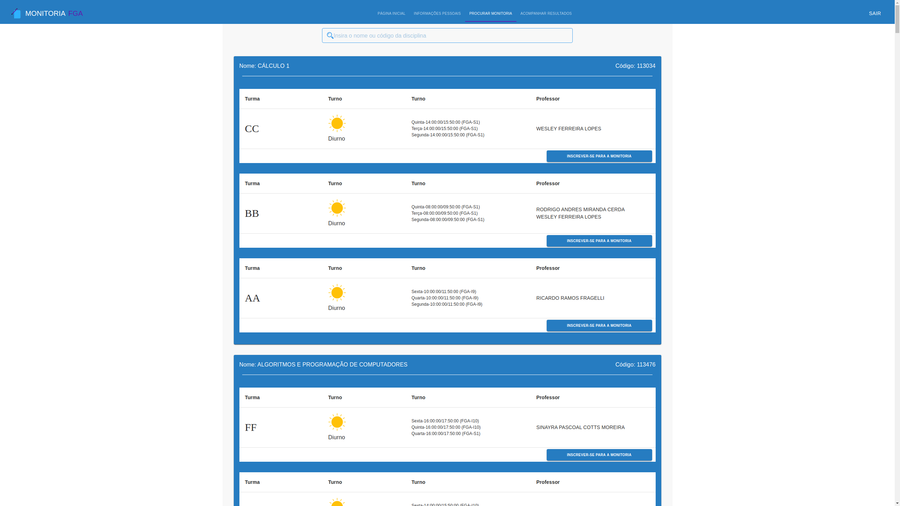

# Apresentação Final

## Histórico de Revisão:
| Data | Versão | Descrição | Autor |
|:---:|:---:|:---:|:---:|
| 17/11/19 | 0.1 | Adicionando introdução e discorrendo sobre Gerência e funcionalidades | [Paulo Vitor](https://github.com/PauloVitorRocha), [João Rossi](https://github.com/bielrossi15) |
| 17/11/19 | 0.2 | Adicionando a explicação do produto, desenvolvimento e trabalho em equipe | [Paulo Vitor](https://github.com/PauloVitorRocha), [João Rossi](https://github.com/bielrossi15) | 
| 17/11/19 | 0.3 | Adicionando imagens do produto | [Paulo Vitor](https://github.com/PauloVitorRocha), [João Rossi](https://github.com/bielrossi15) | 

## 1. Introdução
Este documento refere-se a apresentação final do grupo A Monitoria da matéria Arquitetura e Desenho de Software.
Ele tem como objetivo tentar demonstrar todo o trabalho realizado pela equipe ao longo do semestre, não só demonstrando o produto final mas também descrevendo um pouco sobre metodologia utilizada e mostrando artefatos típicos de Desenho de Software e alguns dos padrões de projeto utilizados.

## 2. O produto
A ideia do produto passou por uma seleção criteriosa, utilizando 3 métodos para a escolha, sendo eles:   

- [5W2H](../../dinamica_seminario_I/definicao_tema/5W2H/);
- [Rich Picture](../../dinamica_seminario_I/definicao_tema/rich_picture/);  
- [Ishikawa](../../dinamica_seminario_I/definicao_tema/ishikawa/);  
   
Foram utilizados os documentos para levantar necessidades, fluxos de trabalho e possíveis problemas que seriam encontrados no decorrer do projeto, sendo a escolha final baseada numa votação entre os membros do grupo com opiniões baseadas nos levantamentos finais da documentação auxiliar.

Foi criado também um [Documento de Visão](../extras/documento_visao.md) para ajudar o processo de entendimento do escopo do projeto, além de alguns artefatos para elicitação, como [Protótipo](../../dinamica_seminario_I/Elicitacao/prototipo/) e [Questionário](../../dinamica_seminario_I/Elicitacao/questionario/) para ajudar a visualização do levantamento do escopo assim como a opinião de futuros usuários sobre o escopo e algumas funcionalidades do projeto.

Para ajudar a equipe a entender como o produto funcionaria a um nível de mercado, a priori, foi criado um documento de [Benchmarking](../../dinamica_seminario_I/benchmarking/) para a equipe definir os diferenciais do produto em relação aos concorrentes no mercado.  
Além da posição no mercado em que o produto se encontraria, foi escolhido levantar os possíveis custos e lucros do produto com um documento de [Estimativas de Custo](../../dinamica_seminario_I/estimativas_de_custo/).

Por final, a equipe montou um documento de [Identidade Visual](../../dinamica_seminario_II/identidade_visual/) para manter um padrão bem definido sobre o design do produto.

## 3. Gerência
O presente tópico busca definir e formalizar as metodologias de trabalho que foram aplicadas no desenvolvimento do projeto. Nesse sentido, quanto as metodologias pertinentes ao escopo de elaboração da aplicação, podemos citar o scrum, kanban, extreme programming. Já para as metodologias de gerência temos, reuniões, quadro de conhecimento e avaliações de desempenho com burndown, velocity. Para um melhor detalhamento sobre metodologia visite a página de [Metodologias](https://2019-2-arquitetura-desenho.github.io/wiki/dinamica_seminario_II/metodologias/) em nossa [Wiki](https://2019-2-arquitetura-desenho.github.io/wiki/).

## 4. Funcionalidades
O escopo do projeto foi definido entre os membros do grupo em conjunto com a professora Milene Serrano. As funcionalidades foram definidas a partir de um [questionario](https://2019-2-arquitetura-desenho.github.io/wiki/dinamica_seminario_I/Elicitacao/questionario/) para alunos e professores da universidade. As funcionalidades foram também definidas por meio de um [protótipo](https://2019-2-arquitetura-desenho.github.io/wiki/dinamica_seminario_I/Elicitacao/prototipo/) o que facilitou a limitação de escopo do projeto.

## 5. Desenvolvimento
Entrando na competência do desenvolvimento, a equipe se ateve primeiro ao gerenciamento do projeto com documentos para o controle e definição da aplicação para depois criar diagramas UML do projeto, seguido das especificações dos padrões para a solução dos problemas que seriam encontrados durante o decorrer do projeto e por fim, um documento de arquitetura para falar da integração e funcionamento deste produto software em suas 3 frontes principais: Web Crawler, Front-end e Back-end.

### Diagramas e Documento de Arquitetura

Foram feitos diagramas UML estáticos e dinâmicos, para ter a representação do produto em diferentes níveis de detalhes. 

#### Diagramas Estáticos
- [Diagrama de Classes](../../dinamica_seminario_III/diagrama_classes/);
- [Diagrama de Pacotes](../../dinamica_seminario_III/diagrama_pacotes/);

#### Diagramas Dinâmicos
- [Diagrama de Sequência](../../dinamica_seminario_III/diagrama_seq/);  
- [Diagrama de Estado](../../dinamica_seminario_III/diagrama_de_estados/);
- [Diagrama de Atividades](../../dinamica_seminario_III/diagrama_de_atividades/);

Além dos diagramas para avaliação do funcionamento do produto, foi feito também o [Documento de Arquitetura](../../dinamica_seminario_V/documento_arquitetura/) para ajudar no entendimento do funcionamento do frontend, backend e do crawler e como ocorreria essa integração entre elas e o funcionamento de cada uma.

### Patterns

No que compete a padrões de projeto, a equipe selecionou alguns específicos para resolver os problemas do nosso produto. Foram utilizados diferentes padrões em nossos 3 repositórios e aqui tem-se o detalhamento de cada um:  

- [Patterns Web Crawler](../../dinamica_seminario_IV/webcrawler_patterns/);  
- [Patterns Front-end](../../dinamica_seminario_IV/front-end_patterns/);  
- [Patterns Back-end](../../dinamica_seminario_IV/back-end_patterns/);  

## 6. Trabalho em Equipe
A equipe trabalhou seguindo o documento de [Metodologias](../../dinamica_seminario_II/metodologias/) e como foi explicado na parte de gerência, foram utilizadas práticas de 3 diferentes metodologias, scrum, XP e kanban, utilizando algumas técnicas, como o pair programming, quadro de conhecimento, entre outros.

**O projeto foi dividido em 4 repositórios:**

- [Wiki](https://github.com/2019-2-arquitetura-desenho/wiki) - Nesse repositório toda a documentação foi mantida;
- [Front-end](https://github.com/2019-2-arquitetura-desenho/monitoria-app) - Repositório dedicado apenas ao front-end do projeto, em React;
- [Back-end](https://github.com/2019-2-arquitetura-desenho/monitoria-api) - Repositório com o código da API;
- [Web Crawler](https://github.com/2019-2-arquitetura-desenho/monitoria-crawler) - Repositório do Web Crawler para salvar as matérias oferecidas na FGA;

## 7. O produto

#### Página de Login

#### Página de Cadastro

#### Página Inicial

Continuação:

#### Página de Informações Pessoais

#### Página de Cadastro em Monitoria

#### Página de Resultados 

## 8. Referências

