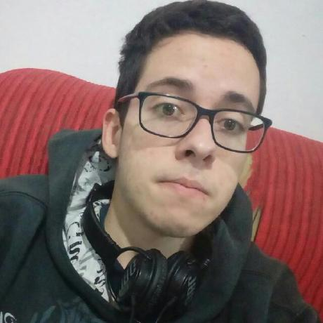

# INÍCIO

!!! info "Sobre a página"
    Página destinada à disciplina de Arquitetura e Desenho de Software (2019.2). Reserva-se a armazenar e apresentar os artefatos produzidos na disciplina, assim como materiais correlatos.

Código fonte do projeto: [GitHub - Desenho e Arquitetura de Software](https://github.com/2019-2-arquitetura-desenho)

## EQUIPE

| Foto | Nome (Primeiro e Último) | Email | GitHub |
|:----:|:------------------------:|:-----:|:------:|
|  | André Pinto | andrelucax@gmail.com | [andrelucax](https://github.com/andrelucax) |
|  | Gustavo Lima | gustavomarques.gml@gmail.com | [gustavolima00](https://github.com/gustavolima00) |
|  | Ivan Dobbin | ivandinizdobbin2@gmail.com | [darmsDD](https://github.com/darmsDD) |
|  | João Rodrigues | joaomatheus.152013@gmail.com | [rjoao](https://github.com/rjoao) |
|  | João Rossi | bielrossiborba@gmail.com | [bielrossi15](https://github.com/bielrossi15) |
|  | Leonardo Medeiros | leonardomedeiros.6@gmail.com | [leomedeiros1](https://github.com/leomedeiros1) |
|  | Lieverton Silva | lievertom@gmail.com | [lievertom](https://github.com/lievertom) |
|  | Lucas Maciel | lucasmacielaguiar@gmail.com | [Ridersk](https://github.com/Ridersk) |
|  | Paulo Rocha | paulovitorrocha.unb@gmail.com | [PauloVitorRocha](https://github.com/PauloVitorRocha) |
|  | Rafael Makaha | makahaemail@gmail.com | [rafaelmakaha](https://github.com/rafaelmakaha) |
|  | Welison Regis | welison.almeida.923@gmail.com | [WelisonR](https://github.com/WelisonR) |
